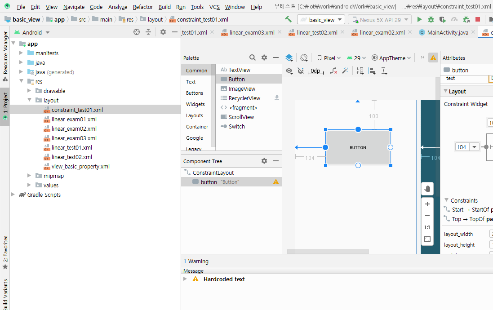
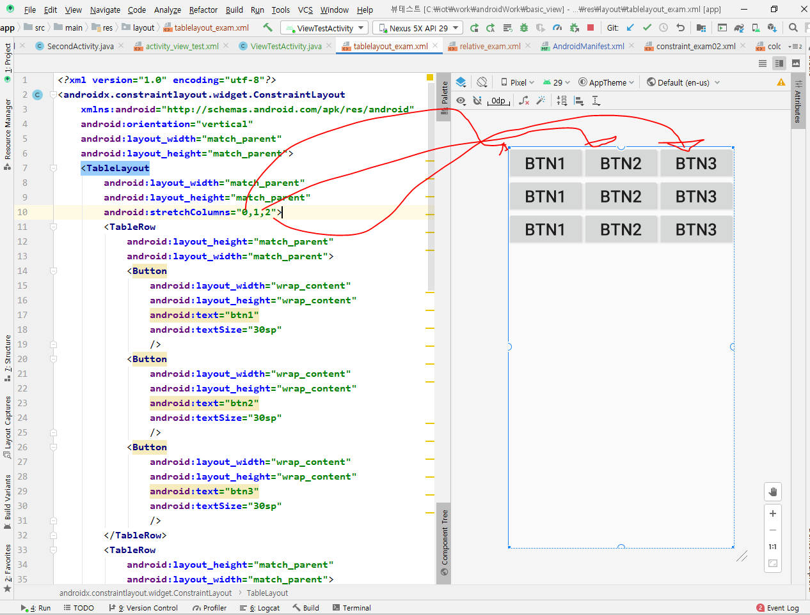
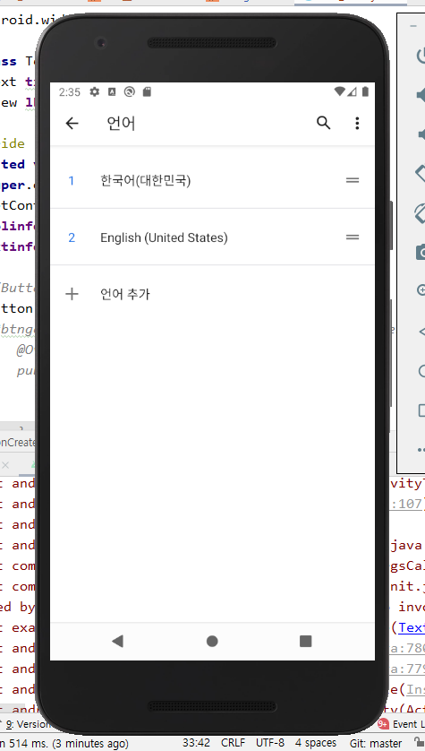
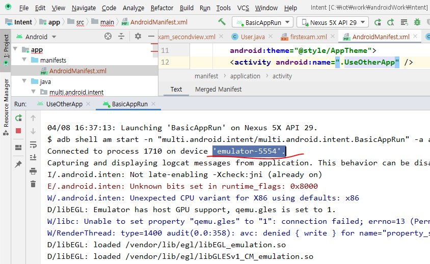

# Android

## Android 설치방법


AVD 안드로이드 버추얼 디바이스 -JVM과 같은 의미


위와 같이 선택해주고 폴더는 동일하게 설정해주고 설치해준다.


설치가 끝났을 때 Start Android Studio  체크 해제하고 Finish 눌러서 닫아준다.. 

그리고 윈도우에서 Android Studio Setup Wizard 실행해준다.


위처럼 Do not import settings 체크하고 설정을 계속해준다.


위에서 standard 타입을 선택해준다.


테마는 기호에 맞게 설정해준다.


그리고 위 페이지에서 설정을 기다려준다.


그리고 설치가 위와 같이 끝나면 


이 페이지에서 start a new Android Studio project를 선택한다.


## 컴포넌트 기반

라이프 사이클을 안드로이드 내부에서 관리한다.

##### Activity - 화면을 의미

##### Service - 화면이 아닌 back단에서 실행되는 것. 눈에 보이지 않지만 서비스가 뒤에서 실행되고 있다.

##### Content Provider -  어플리케이션 내에서 사용할 수 있는 데이터를 '공유'하기 위한 컴포넌트이며 '어플리케이션 계층'과 '데이터 계층'을 분리하여 중간 가교 역할을 한다.

##### BroadcastReceiver - phone의 상태를 알려주는 역할을 한다. 

##### Intent -하나의 컴포넌트에서 다른 컴포넌트들을 실행시킬 수 있는 객체  


## 리소스의 의무화

리소스의 R

​	문자열 이미지

​	화면 

​	외부파일 R.java


여기 위에서 wear OS 는 시계와 지도 mark 위젯을 의미하고 phone and tablet은 스마트폰이나 tablet pc기본설정, TV는 티브이, Automotive는 자동차, Android Things는 사물인터넷(IoT)을 의미한다. 


package name은 사람들이 앱 마켓에 올라갔을 때 인식하는 코드명으로 쓰일 것이기에 식별할  수 있게 유일한 키로 설정해줄것


위의 phone and tablet 에서 empty activity를 선택하고 save location에서 폴더를 선택하고 select path에서 5번째 버튼을 누르고 새로운 폴더를 만든다. 


언어는 java이고 minimum SDK는 Android 4.1 버전을 선택한다.

위에서 help me choose를 누르면 아래와 같이 나온다. 여기서 보면 4.1 Jelly Bean 버전은 99.6%의 사용자가 사용하고 있다는 의미이다.


위와 같이 프로젝트 설정을 하고 finish(마침) 버튼을 누르면 위의 화면처럼 나온다.

File → settings


상위 오른쪽 AVDM버튼을 클릭해서 Android Virtual Device Manager 를 열고 여기서 create virtual device configuration 열어서 Nexus 5X를 선택하고 next버튼을 눌러준다.


그러면 위와 같은 페이지가 뜨는데 여기서  Q다운로드 선택하고 아래와 같이 SDK Quickfix Installlation에서 accept 선택하고next버튼을 눌러서 설치를 해준다. (Q for Android 10 version)   


그리고 설치가 다 되면 위 화면에서  finish 버튼을 눌러 설치를 완료해준다.


그리고 나면 위와 같이 화면이 바뀌어 있다.


설치되고 나면 위 화면에서 finish를 누른다. 그러면 아래와 같은 화면이 나온다.


그리고 위의 빨간 동그라미 실행 버튼을 키면 왼쪽처럼 google 마크가 뜬다.


그리고 실행이 끝나면 왼쪽 처럼 HelloWorld가 뜬다.


안드로이드의 logcat이용해서 기록을 확인한다.

servlet에서 요청이 들어오면 doGet() doPost( )해서 서비스 하는 것처럼 activity 는 만들어지는 시점이 있 ek.


위에서 MainActivity 클래스의 상위 클래스는 AppCompatActivity이고 이 안에 onCreate라는 메소드가 있고 반드시 필요하다.


AndroidManifest는 안드로이드 설명서 파일이다.


MainActivity는 화면을 만드는 부분이다.

이미지 파일이 저장되는 곳이다.


위 빨간줄 쳐 놓은 hdpi 등은 해상도에 따라서 나누어 놓은 것이다.


Mainactivity 폴더는C:\iot\work\androidWork\HelloWorld\app\src\main\java\com\example\helloworld  이 경로에 있다.


앱으로 추출할 때 저 경로에 있는MainActivity 파일들이 실제로 압축된다.


여기서 /를 기준으로 왼쪽은 폴더명 /를 기준으로 오른쪽은 파일명이다.

@은 reference 한다는 의미이다.


설정을 다 했으면 위와 같이 run → run activity를 눌러서 실행해준다.


새로운 프로젝트 작성

new project

App명: firstPro

package: exam.day01.first

프로젝트명: firstPro

화면에 표시된 레이블을 지우고 버튼 세 개를 추가

확인, 취소, 삭제

글꼴 변경

font-family: 

avd에 실행해보기


AndroidManifest.xml 파일에는 한글로주석을 달면 안 된다.


onclick을 눌르려고 해도 아무것도 안 뜬다. 이때 


위와 같이 설정해 주었을때 라이브러리가 추가 안 되어서 빨간색으로 뜬다. 이때 alt shift 엔터를 눌러서 import 해준다.


### View

match-parent의미는 자기가 갖고 있는 폰 사이즈만큼 꽉 차게 layout을 형성하겠다라는 의미이다.

```visual basic
#view_basic_property.xml
<?xml version="1.0" encoding="utf-8"?>
<LinearLayout xmlns:android="http://schemas.android.com/apk/res/android"
    xmlns:app="http://schemas.android.com/apk/res-auto"
    xmlns:tools="http://schemas.android.com/tools"
    android:layout_width="match_parent"
    android:layout_height="match_parent"
    android:orientation="vertical"
    tools:context=".MainActivity">
    
    <Button
        android:id="@+id/btnOk"
        android:layout_width="match_parent"
        android:layout_height="wrap_content"
        android:text="Button" />

    <Button
        android:id="@+id/btnSearch"
        android:layout_width="match_parent"
        android:layout_height="wrap_content"
        android:text="Button" />

    <Button
        android:id="@+id/button3"
        android:layout_width="match_parent"
        android:layout_height="wrap_content"
        android:text="Button" />

</LinearLayout>


```

<!--configuration for android-->

layout_width: view의 너비
layout_height: view의 높이
orientation: 배치방향

id:각 위젯을 식별할 수 있는 이름

​	btn

​	txt

margin: 주위여백

padding: 내부 컨텐츠와 border사이의 간격을 결정

layout_weight: 여백을 해당 view의 사이즈로 포함한다

layout_gravity: parent내부에서 view의 정렬

gravity: view내부에서의 정렬이다.(글자의 위치를 정렬할 수 있다)


.xml 파일은 반드시 닫는 태그가 필요하다.

​	

위와 같이 에러가 뜨는 이유는 200이란 숫자 뒤에 단위를 붙이지 않았기 때문이다.


그래서 위와 같이 변경해준다.

200dp란 의미는 1인치당 200개의 pixel(점)이 들어간다는 의미이다. 


위 그림의 layout_height를 match_parent에서 wrap_content로 변경해준다.


패키지 변경과 layout 변경할 때

#### .xml 파일 이름 바꾸는 방법


이렇게 경로를 찾아서 들어가면 아래와 같은 화면이 뜬다.

]

여기서 Rename 란에 이름을 view_basic_property.xml로 이름을 변경해준다.


여기서 이름을 변경해준 다음 Do Refactor를 눌러 적용해 주어야지 이름이 바뀐다.


Do Refactor를 누르면 위와 같은 화면이 뜨고 빨간 줄 옵션을 적용해준 다음 OK버튼을 누르면 적용이 된다.


밑의 버튼 layout을 만들려면 layout_margin을 20dp로 만들어주고 padding도 20dp로 설정을 해주면 아래와 같은 설정이 나온다.


그리고 색깔을 아래와 같이 설정해주면


위와 같이 색깔이 나온다.

모든 Linearlayout은 layout 안에 중첩해서 사용이 가능하다.

linear_exam03.xml

constraint layout은 relative layout보다 우수하다.



위와같이 왼쪽과 탑을 눌러서 위치를 조정할 수 있다.

만약 위치에 대한 정보가 설정이 안 되어 있으면 에러가 난다.

anker point


위에서 Add Horizontal Guildline


intent배우기 전까지는 MainActivity이다. 핸드폰의 앱을 시작했을 때 나오는 첫화면을 구성하고 있는 파일이 MainActivity이다.

 

세로형과 가로형이 따라 존재한다.


텍스트 뷰를 사용하기 위해서 file→settings들어가서 위와 같이 설정해준다.


TextView 문서이다.


외부에서 textview의 id로 접근해야 되기 때문에 id로 접근하는 것은 필수이다.

@id 내가 아이드를 줄 때

@android 안드로이드에 설정되어 있는 아이디를 참조해서 쓸 때


저 보라색 블럭 설정된 곳에서 ctrl+q를 누르면 다음과 같이 설명이 나온다.


이런 에러가 발생하였을 때에는 뷰부터 설정하고 TextView 클래스에 불러와야 되는데 뷰도 없이 TextView를 불러와서 에러가 났다. 그래서


위와 같이 수정하고 실행하면 위와 같이 안녕이란 글자가 나온다.


ctrl f shift shift 


plugins





fitxy를 쓰면 위와 같이 화면을 그냥 늘려놓은 느낌이다. 그래서 가운데부터 늘려주는 centerCrop을 많이 쓴다.


주로는 fitXY보다 centercrop을 많이 쓴다.


이미지 선택 버튼으로 이미지를 변경하고 싶으면 위와 같이 구성한다.


FrameLayout vs LinearLayout

FrameLayout은 내가 출력하고 싶은 이미지들을 여러장 겹쳐 놓았다가 내가 원할 때 원하는 이미지를 보여준다.

그리고 LinearLayout은 내가 필요한 버튼이나 이미지를 묶어넣고 출력되는 방향을 정할 수 있다.(horizontal 수평) 또는 (vertical 수직)으로


위는 horizontalScroll이 있어서 왼쪽 오른쪽으로 이미지가 이동할 수 있다.

이벤트를 발생하는 경우가 언제인지? 버튼이 이벤트 소스이다.


안드로이드에서는 id로 식별성을 보장한다.


위와 같이 설정을 해주고 실행해서 이벤트 테스트 버튼을 누르면  익명 이너 클래스 라는 메시지가 뜬다.


### 그래디언트 실습


그래디언트를 실습하는 방법

그래디언트 코드를 왼쪽과 같이 구현하고 오른쪽과 같이 결과를 낼 수 있다.





### AVD에 관한 에러가 떳을때


여기 들어가서 .lock 파일들을 지워준다.


또는 여기 AVD들어가서 wipe data 누르면 오류를 지우고 해결할 수 있다.


etc


Activity는 앱을 구성하는 요소 중에 화면을 의미한다.


위 화면 빨간줄 앞 삽입하는 곳에 casting 작업을 해 주어야 하는데 새로운 버전에서는 자동으로 casting 되기 때문에 해 줄 필요가 없다.


위에 있는 요소들 중 밑에 있는 빨간 동그라미에 있는 요소들로 할 것이다.


view를 만들 때에는 위와 같이 작성한다.


위 사진은 폴더 안에 파일을 넣어 놓은 모습이다.


이거를 ctrl + o로 실행한다.


새로운 뷰 추가하기 버튼을 누름으로서 밑의 두 버튼이 추가 되었는데 이 요소들은 한 번만 추가된다.


선택위젯


## 사용자 정의 Adapter 만들기

#### -안드로이드에서 앱을 구성할 때 목록형식을 가장 많이 사용한다.

#### -사용자정의로 디자인한 뷰를 목록으로 사용하고 싶은 경우

#### -안드로이드 내부에서 제공하는 Adapter로 표현하고 싶은 내용을 모두 표현할 수 없다.(이벤트연결, 각 목록의 구성을 다르게 생성...)

#### [구성요소]

#### -Adapter를 이용해서 출력할 데이터를 저장하는 객체(DTO)


여기서 generate를 선택하면 이것을 통해 constructor랑 toString 그리고 getter/setter를 통해 DTO(Data Transfer Object)를 생성할 수 있다.


그러나 보통은 변수를 참조해서 사용하기 때문에 constructor만 생성해서 사용한다.

 

#### -사용자정의 Adapter

1) 안드로이드에서 제공하는 Adapter클래스를 상속한다.

​	-리스트뷰를 만들때 필요한 정보를 저장할 수 있도록 멤버변수 정의(Context, row디자인 리소스, 데이터)

2) 생성자 정의

​	-상속받고 있는 ArrayAdapter의 생성자 호출

3) ArrayAdapter에 정의되어 있는 메소드를 오버라이딩

​	-getView: 리스트뷰의 한 항목이 만들어질 때마다 호출된다.

​	=> 전달된 리소스를 이용해서 뷰를 생성한다.(LayoutInflator)

​	=> 한 row를 구성하는 뷰를 찾아서 데이터와 연결한다.

4) getView메소드에서 성능개선을 위한 코드를 작성한다.

​	-한 번 생성한 view를 재사용

​	-findViewById는 한 번만 찾아온다.

5) ViewHolder객체를 생성한다.

​	-row를 구성하는 뷰를 한 번 findViewById하기

​	-row에 대한 구성 View를 멤버변수로 선언

​	-생성자에게 findViewById처리를 구현

​	-최초로 뷰를 만들 때(row에 대한 뷰)이 객체를 생성해서 활용

6) row를 구성하는 뷰에 상태값을 저장하기

​	-각 뷰의 이벤트를 통해 저장

​	-각 뷰의 상태값을 저장할 수 있도록 객체 생성

​		: 상태값을 저장한 객체를 자료 구조에 저장

​		focus를 잃어버릴때 상태를 저장


#### -Adapter를 통해 만들어진 리스트뷰를 보여줄 액티비티

* main Layout 필요
* 


이 copy class는 save as 와 같은 기능을 한다.


이 위의 화면을 보면 

### 인텐트

### [기본실행]

#### 1. 인텐트 객체 설정하고 실행할 액티비티의 정보와 데이터를 셋팅

#### -값 

putExtra


#### 2. 안드로이드 OS에 인텐트 객체 넘기며 의뢰하는 작업

#### 액티비티를 실행하는 경우 → startActivity

```java
//밑의 작업이 의뢰 작업이다.
startActivity(intent);
```


#### 3. 인텐트에 설정되어 있는 액티비티 호출

#### 4. 호출된 액티비티에서는 안드로이드OS가 넘겨준 인텐트를 가져온다.

#### 5. 인텐트에 셋팅된 데이터를 꺼내서 활용한다.


위와 같이 Manifest를 설정해놓고 밑의 MainActivity 를 실행하면 아래와 같이 오류가 난다.


그래서 위와 같은 ActivityNotFoundException에러를 해결하려면 먼저 ctrl + /을 눌러서 주석을 해제시킨다.


그리고 ctrl + s를 눌러 저장한 다음 MainActivity로 넘어가서 ctrl+shift+F10을 눌러서 실행해주면 맨 처음 '액티비티실행하기' 버튼이 나오고 이것을 누르면 아래와 같이  설정한 SecondActivity  출력화면이 나온다.


그러면 호출된 액티비티라는 두번째 액티비티로 갔다가 ''액티비티 닫기 '' 버튼을 누르면 '두 번째 액티비티에서 실행 완료'라는 Toast메시지가 뜬다.




이 빨간줄이 전화번호이다.


