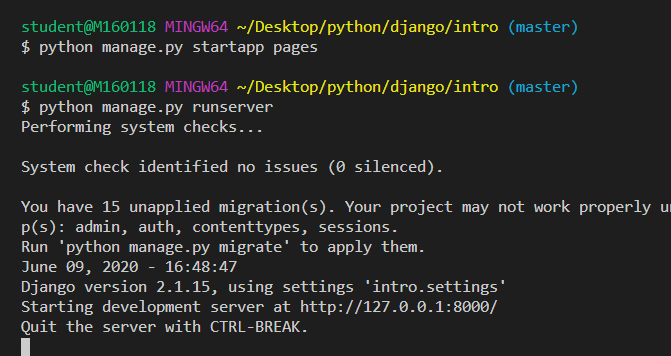
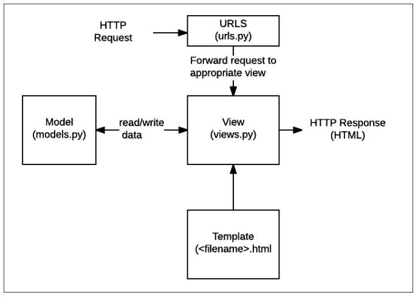

# Django Intro

## Start Django

1. 장고 설치

```bash
pip install django==2.1.15
pip list
```

2. 프로젝트 생성

```bash
django-admin startproject <프로젝트 명>
```

장고 서버를 아래의 명령어로 실행해준다.

```bash
python manage.py runserver
```

그 다음 127.0.0.1:8000으로 접속하면 다음과 같은 화면이 나온다.


3. 프로젝트 생성 시 제공되는 파일

* manage.py
  * 전체 Django와 관련된 모든 명령어를 manage.py를 통해 실행 합니다.

* `__init__.py`
  * 현재 `__init__.py`파일이 존재하는 폴더를 하나의 프로젝트, 혹은 패키지로 인식하게 해주는 파일

* settings.py
  * 현재 프로젝트의 전체적인 설정 및 관리를 위해 존재하는 파일
* urls.py
  * 우리 웹 서비스로 접근하기 위한 경로가 있는 파일
  * 내 프로젝트에 접근할 수 있는 경로를 설정하기 위한 파일
* wsgi.py
  * 설정한 것을 배포해주는 역할을 해준다.

아래와 같이 사용할 앱을 생성을 해주고 settings.py 가서 등록을 해준다.



settings.py 에서 설정해 주어야 하는 요소


위와 같이 'pages'앱을 추가 해주고 밑과 같이 장소와 시간 설정도 변경해준다.


* admin.py
* apps.py
* models.py
* tests.py

* views.py

그리고 .gitignore 파일도 만들어준다.

.gitignore 설정 하는 방법


여기서 위와 같이 입력하고 생성버튼을 누르면


그러면 위와 같이 파일이 생성된다.

그랬을 때 .gitignore 파일을 생성해 넣어주면 된다.


url  view template 순서로 과정을 진행할 것이다.

https://developer.mozilla.org/ko/docs/Learn/Server-side/Django/Introduction 여기로 들어가면

아래의 그림 구성도를 볼 수 있다.



templates 폴더를 경로로 설정해주지 않는 이유

파일 이름만 넣어주어도 자동으로 templates 폴더 이하의 파일을 우선순위로 찾기 때문에 파일 이름만 넣어주어도 된다. 

이름 나이를 리스트로 만들어 넘겨줄 것

skribbl.io

페르소나

수요자가 필요한 기능에 집중해서 기획할 것!!

가용 가능한 웹 서비스

타슈가 있는지 없는지

수요예측 한 정거장에 데이터 수집

자전거 리필하는 수량

날씨, 시간에 대한 data

Agile

minimalism하게 계획을 세울 것

DB구조 자체를 정의: schema

Django sqllite3

오브젝트 객체랑 매핑해주는것

파이썬에서 객체 정의

열: 컬럼 | 행: 레코드


위와 같이 DB를 정의하고 


아래와 같이 python manage.py makemigrations 명령어를 주면 0001_initial.py라는  첫번째 버전의 DB모델이 정의된 파일이 생성이 된다.

그리고 python manage.py migrate articles를 이용해 DB모델을 articles란 앱에 적용해 준다.


그리고 아래처럼 python manage.py shell을 치면 db로 접근 가능한 python 쉘 창을 켤 수 있다.


 Admin 관리자 페이지에 접근하기 위해서는 아래와 같은 명령어를 통해서 접근해야 한다.


아래와 같이 글이 정리된다.

