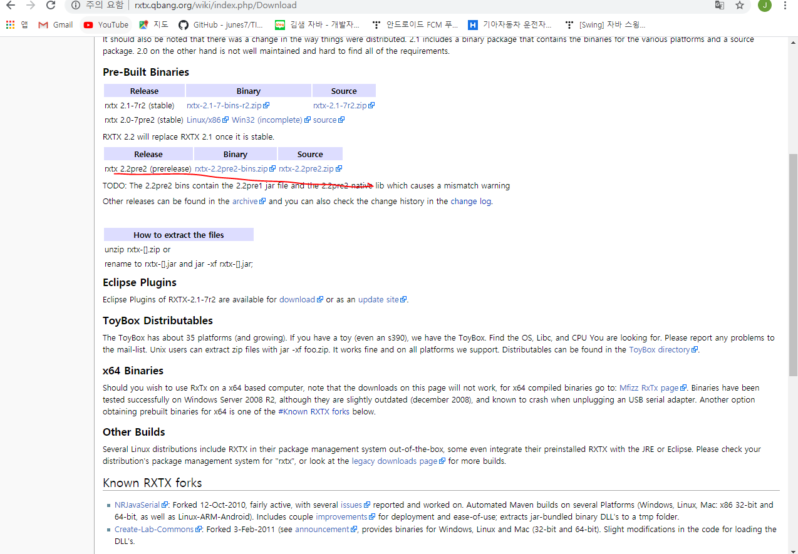
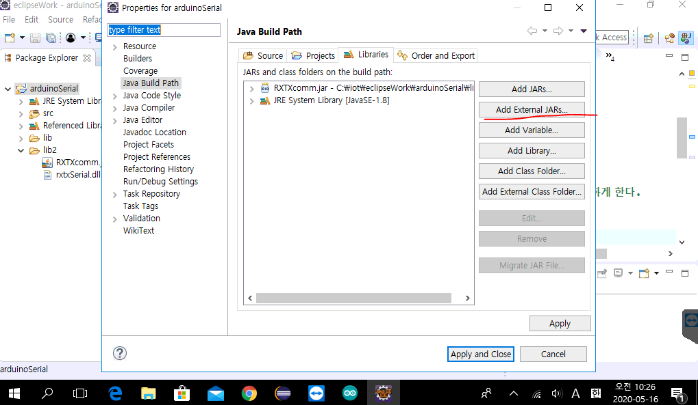
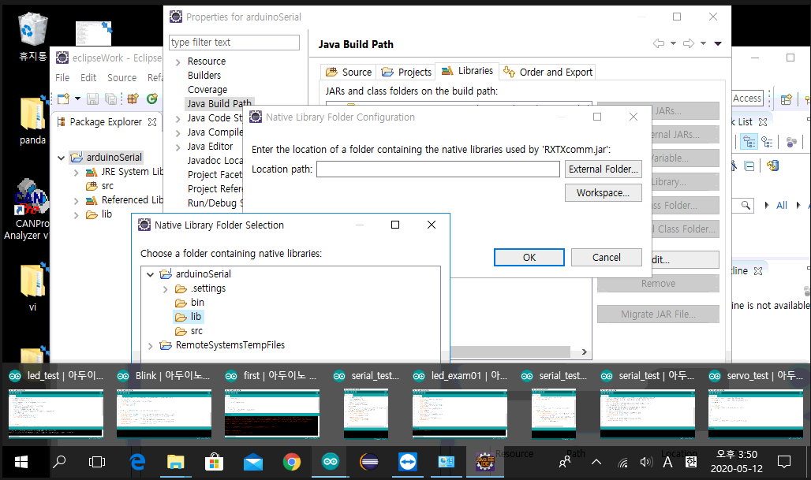
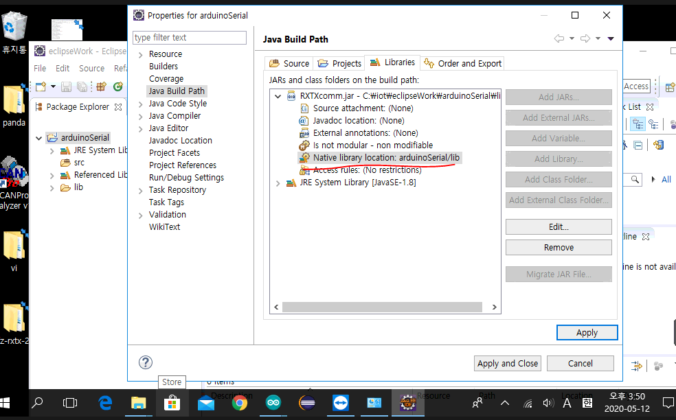
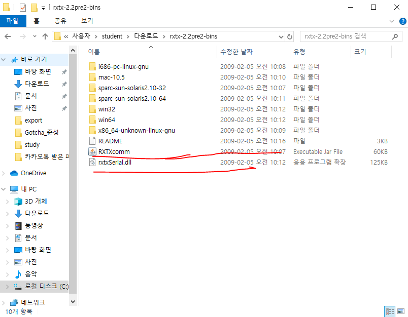
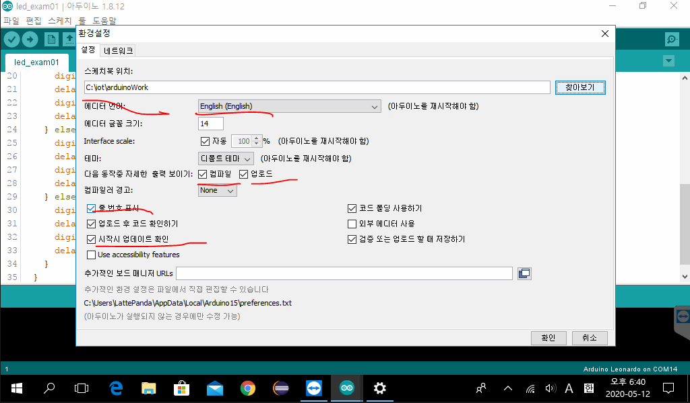
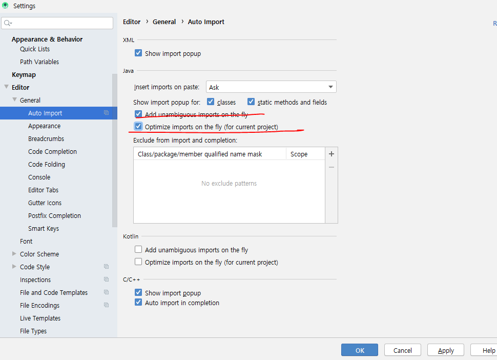
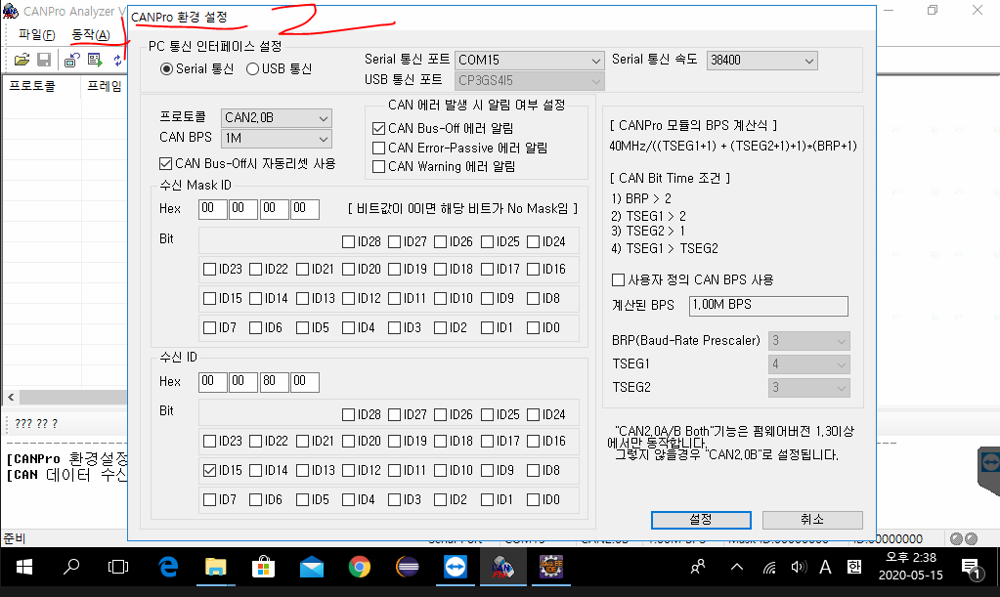
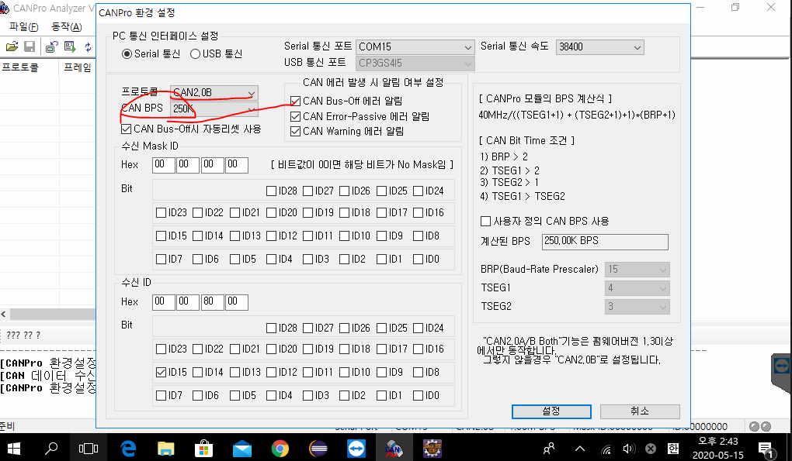

# LattePanda 사용방법

여기 아두이노 페이지에서  컴파일이랑 업로드 체크해줄 것!!!

* 아두이노에서 쓸 수 있는 함수들의 목록

https://www.arduino.cc/reference/en

//시리얼 통신을 시작하겠다는 의미 - 시리얼 통ㅅ힌을 위한 기본작업을 의미

Serial.begin(9600);//통신속도를 정의

Serial.println("Hello arduino");

Serial.available()은 입력값이 있는지 판단 - 통신으로 입력받는 값을 읽기

전에 반드시 체크를 하고 시작. 시리얼 통신이 가능한지 체크하는  것

Serial.read()는 한 바이트씩 읽고 읽은 바이트를 버퍼에서 지운다.

읽을 값이 없으면 -1을 리턴

버퍼의 맨 앞에 바이트를 하나 읽고 읽을때마다 읽은 바이트가 

사라지면서 버퍼에 남은 데이터가 하나씩 당겨진다.

Read는

java

ava

va

a 

이 순으로 읽는다.

센서나 led 등 엑추에이터 장치를 동작하라고 명령

센서나 led 등 엑추에이터 장치를 stop하라고 명령

# RxTx 다운로드 방법

위 사이트에서 이것을 

라이브러리에 포트 

# 스마트카 vs 커넥티드 카
* 스마트카: 스스로 판단하고 액션을 취할 수 있는것
* 커넥티드 카: 차가 컴퓨터이다 개념
통신기술을 이용해 서비스를 받을 수 있도록
통합적인 개념이다.
In hyundai
차량전용 어플리케이션 -> BlueLink
차량전용 클라우드 구축 -> 
마지막 시동을 걸은 시간으로부터 96시간 정도 제어 가능
* 차량제어
  원격시동끄기, 켜기 문 열림/닫힘 제어
* 96시간동안 지속적으로 연결이 되어있기 때문에 그 동안의 보안이슈도 제기되고 있다.

공백기간을 두지 말 것.

다음 주 수요일까지 기본 기능은 다 입혀놓을 것!!!

설정을 위와 같이 해줄 것!!!

여기 위에 따르면 COM14 저 모니터 창이 14번 포트로 통신하고 있기 때문에 위와 같은 에러가 뜬다. 그러므로 반드시 모니터를 끄고 eclipse를 실행해 통신을 시켜주어야 한다.

## [시리얼 통신]

### 1. CommPortIdentifier를 포트의 유효성과 통신가능 상태인지 점검

### 2. CommPortIdentifier의 open메소드를 이용해서 시리얼통신을 할 수 있는 준비상태로 셋팅

#### => 시리얼 통신을 하기 위해 필요한 포트객체가 리턴

#### 															----------

#### 															CommPort

### 3. CommPort는 종류가 2가지

#### -Serial

#### -Parallel

#### :CAN 통신은 Serial통신, 아두이노와 라떼판다도 Serial통신

#### => 각 상황에 맞는 CommPort객체를 얻더야 작업할 수 있다.

### 4. CommPort를 SerialPort로 Casting

### 5. SerialProt객체의 setSerialPortParams메소드를 이용해서 Serial 통신을 위한 기본내용을 설정

#### serialPort.setSerialPortParams(9600,

#### 								SerialPort.DATABITS_8,

#### 								SerialPort.STOPBITS_1,

#### 								SerialPort.PARITY_NONE);

#### 9600은 Serial Port 통신속도

#### 전송하는 데이터의 길이

#### stop bit에 설정

#### PARITY비트를 사용하지 않겠다고 설정

#### -------------

#### 		^

#### 		|________오류를 검증하기 위한 코드

#### => Serial포트를 open하고 설정을 잡아놓은 상태

#### => 전달되는 데이터 (data frame)를 받을 수 있는 상태

### 6. 데이터를 주고 받을 수 있도록 SerialPort객체에서 Input/Output스트림을 얻는다.

#### => 바이트 단위(io클래스 관점)로 데이터가  송*수신 되므로 Reader, Writer계열의 스트림을 사용할 수 없고 InputStream, OuputStream객체를 사용해야 한다.

#### 시리얼포트객체.getInputStream()

#### 시리얼포트객체.getOutputStream()

### 7. 데이터 수신과 송신에 대한 처리

#### 1) 쓰레드로 처리

#### 2) 이벤트에 반응하도록 처리

이렇게 해서 

## CAN PRO 통신방법

\

여기서 CAN BPS가 서로 맞지 않으면 통신이 되지 않는다.

### Serial통신

### 	1. 데이터 읽기

### 			1)

### 			2)

