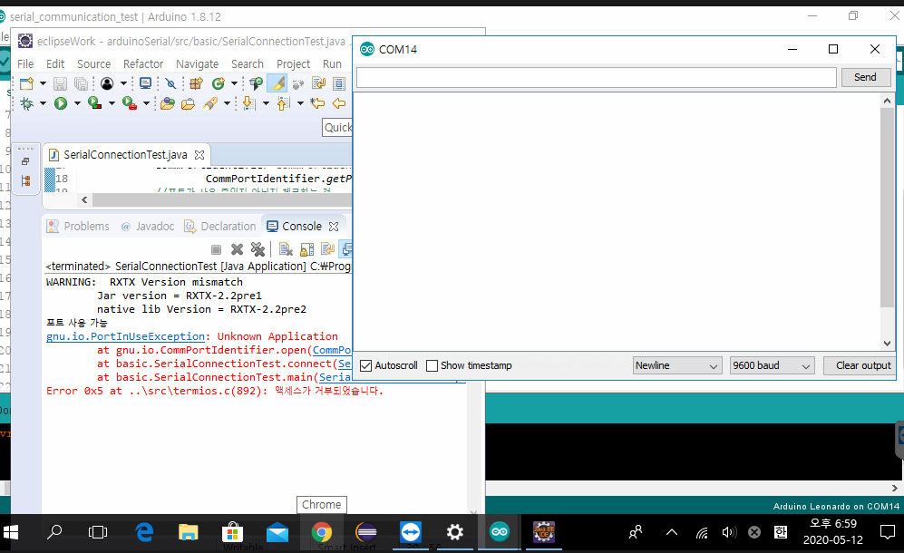
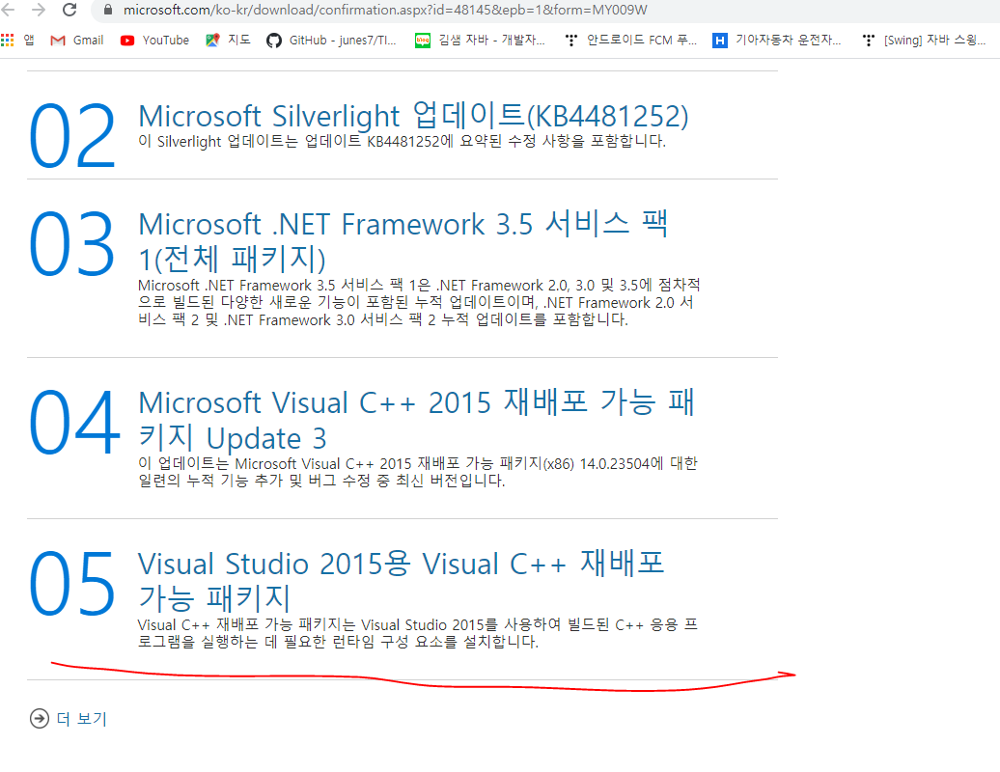
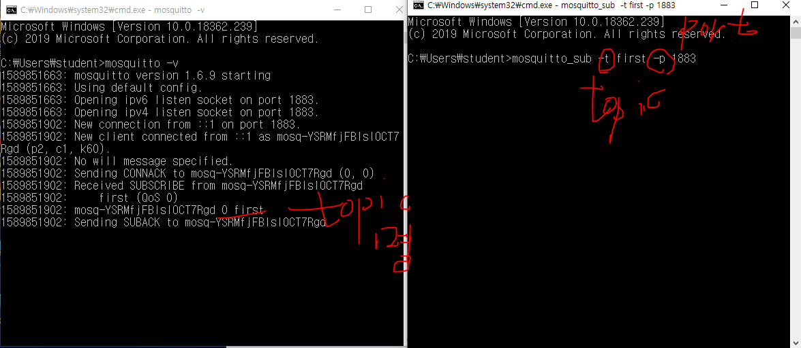
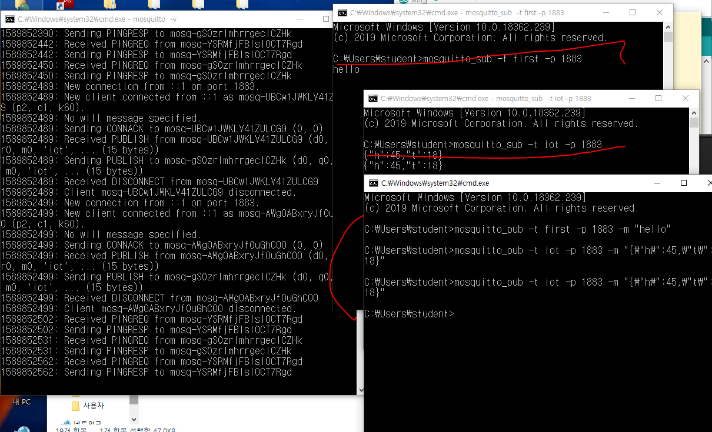
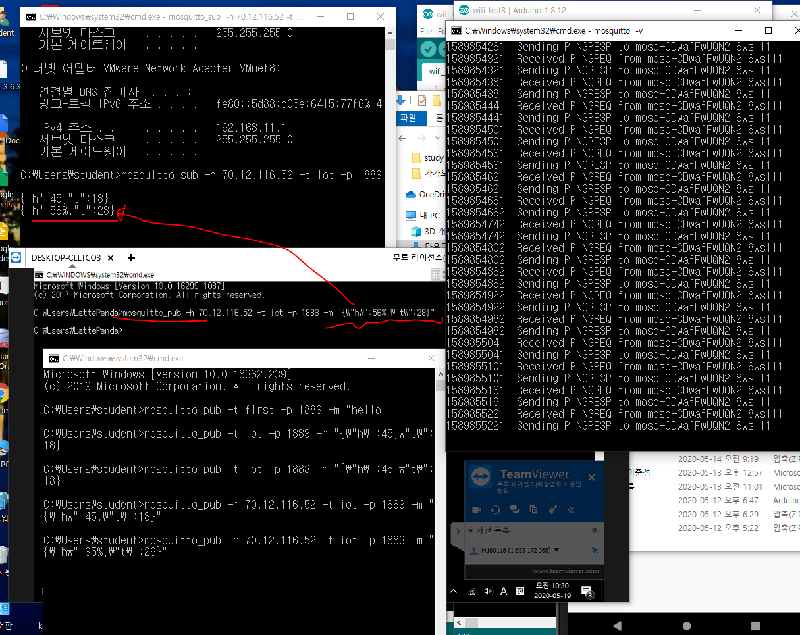
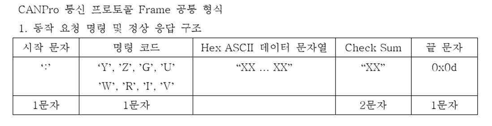
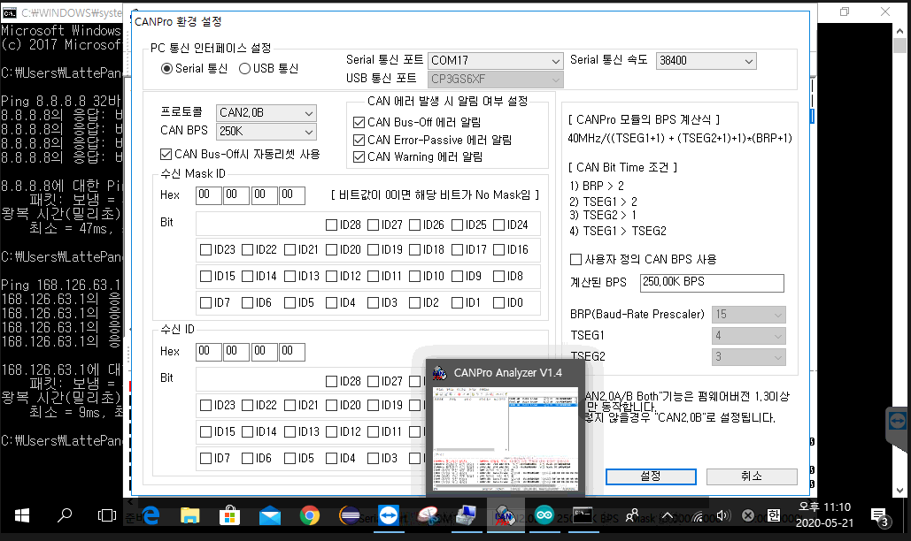

# LattePanda 사용방법


여기 아두이노 페이지에서  컴파일이랑 업로드 체크해줄 것!!!


* 아두이노에서 쓸 수 있는 함수들의 목록

https://www.arduino.cc/reference/en


//시리얼 통신을 시작하겠다는 의미 - 시리얼 통ㅅ힌을 위한 기본작업을 의미


Serial.begin(9600);//통신속도를 정의


Serial.println("Hello arduino");


Serial.available()은 입력값이 있는지 판단 - 통신으로 입력받는 값을 읽기

전에 반드시 체크를 하고 시작. 시리얼 통신이 가능한지 체크하는  것


Serial.read()는 한 바이트씩 읽고 읽은 바이트를 버퍼에서 지운다.

읽을 값이 없으면 -1을 리턴

버퍼의 맨 앞에 바이트를 하나 읽고 읽을때마다 읽은 바이트가 

사라지면서 버퍼에 남은 데이터가 하나씩 당겨진다.

Read는

java

ava

va

a 

이 순으로 읽는다.


센서나 led 등 엑추에이터 장치를 동작하라고 명령


센서나 led 등 엑추에이터 장치를 stop하라고 명령


# RxTx 다운로드 방법


위 사이트에서 이것을 


라이브러리에 포트 


# 스마트카 vs 커넥티드 카
* 스마트카: 스스로 판단하고 액션을 취할 수 있는것
* 커넥티드 카: 차가 컴퓨터이다 개념
통신기술을 이용해 서비스를 받을 수 있도록
통합적인 개념이다.
In hyundai
차량전용 어플리케이션 -> BlueLink
차량전용 클라우드 구축 -> 
마지막 시동을 걸은 시간으로부터 96시간 정도 제어 가능
* 차량제어
  원격시동끄기, 켜기 문 열림/닫힘 제어
* 96시간동안 지속적으로 연결이 되어있기 때문에 그 동안의 보안이슈도 제기되고 있다.

공백기간을 두지 말 것.

다음 주 수요일까지 기본 기능은 다 입혀놓을 것!!!


설정을 위와 같이 해줄 것!!!





여기 위에 따르면 COM14 저 모니터 창이 14번 포트로 통신하고 있기 때문에 위와 같은 에러가 뜬다. 그러므로 반드시 모니터를 끄고 eclipse를 실행해 통신을 시켜주어야 한다.

## [시리얼 통신]

### 1. CommPortIdentifier를 포트의 유효성과 통신가능 상태인지 점검

### 2. CommPortIdentifier의 open메소드를 이용해서 시리얼통신을 할 수 있는 준비상태로 셋팅

#### => 시리얼 통신을 하기 위해 필요한 포트객체가 리턴

#### 															----------

#### 															CommPort

### 3. CommPort는 종류가 2가지

#### -Serial

#### -Parallel

#### :CAN 통신은 Serial통신, 아두이노와 라떼판다도 Serial통신

#### => 각 상황에 맞는 CommPort객체를 얻더야 작업할 수 있다.


### 4. CommPort를 SerialPort로 Casting

### 5. SerialProt객체의 setSerialPortParams메소드를 이용해서 Serial 통신을 위한 기본내용을 설정

#### serialPort.setSerialPortParams(9600,

#### 								SerialPort.DATABITS_8,

#### 								SerialPort.STOPBITS_1,

#### 								SerialPort.PARITY_NONE);

#### 9600은 Serial Port 통신속도

#### 전송하는 데이터의 길이

#### stop bit에 설정

#### PARITY비트를 사용하지 않겠다고 설정

#### -------------

#### 		^

#### 		|________오류를 검증하기 위한 코드

#### => Serial포트를 open하고 설정을 잡아놓은 상태

#### => 전달되는 데이터 (data frame)를 받을 수 있는 상태


### 6. 데이터를 주고 받을 수 있도록 SerialPort객체에서 Input/Output스트림을 얻는다.

#### => 바이트 단위(io클래스 관점)로 데이터가  송*수신 되므로 Reader, Writer계열의 스트림을 사용할 수 없고 InputStream, OuputStream객체를 사용해야 한다.

#### 시리얼포트객체.getInputStream()

#### 시리얼포트객체.getOutputStream()


### 7. 데이터 수신과 송신에 대한 처리

#### 1) 쓰레드로 처리

#### 2) 이벤트에 반응하도록 처리


이렇게 해서 


## CAN PRO 통신방법


\


여기서 CAN BPS가 서로 맞지 않으면 통신이 되지 않는다.


### Serial통신

### 	1. 데이터 읽기

### 			1)

### 			2)





MQTT통신을 위해서 왼쪽은 mosquitto-v를 통해서 서버를 켜 주었고 오른쪽은 mosquitto_sub 를 통해서 데이터를 수신받기 위해서 수신받는 곳 이름을 first라고 하였고 포트번호는 1883으로 설정해 주었다.




오른쪽 맨 밑에 mosquitto_pub는 메시지를 다른 subscribe(mosquitto_sub)로 값을 전달(공표)해 주기 위한 곳이고 여기서 -t 뒤에 전달해줄 곳의 이름과 -m 뒤에 전달해줄 메시지를 설정해 주어 전달해주면 mosquitto_sub에 전달받은 메시지가 출력된다. 



그리고 라떼판다 mosquitto_pub에서 호스트인 desktop에 mosquitto_sub(iot)로 값을 보내준 경우 아래 화살표가 가르킨 것 처럼 나온다. 




### 자바 복습


instanceof란?

-객체 타입을 확인하는데 사용한다. 속성은 이항연산자이고 형변환 가능여부를 가능하면 true 불가능하면 false로 리턴해준다.


```java
/*Instanceof : 객체 타입을 확인하는데 사용한다. 속성은 이항연산자이고 
 *형변환 가능. 주로 상속 관계에서 부모객체인지 자식객체인지 확인
 */

public class InstanceofExam{
    public static void main(String[] args){
		A a = new A();	//A 객체 생성, 부모객체
    	B b = new B();	//B 객체 생성, 자식객체
    
    	//객체 a는 자기 자신의 객체이기 때문에 형변환 가능
        System.out.println(a instanceof A);	//true 출력
        //객체 b는 A의 자식객체이기 때문에 A로 형변환 가능
    	System.out.println(b instanceof A);	//ture 출력
    	//객체 a는 B의 부모객체이기때문에 형변환 불가능
        System.out.println(a instanceof B);	//false 출력
        //객체 b는 자기 자신의 객체이기 때문에 형변환 가능
        System.out.println(b instanceof B);	//true 출력
    }//end of main
}	 //end of class

class A {
    
}
class B extends A {
    
}

```

비동기방식 데이터 수신

웹 에서는 AJAX

Node.js 비동기 웹 서버 구축

UCT ubiquotus

소켓이 가장 쉽고 탄탄하게 접근할 수 있는 기술이다.


하나의 장비안에 여러 장치들이 존재할 때 CAN통신이다.\


CAN장비는 5000원 같이 보여도 30만원 정도

UART통신은 선하고 선하고 연결하는 통신

### CAN통신 데이터 프레임



0x0d 이거는 헥사로 표현한 문자열이이다.


CAN 장비를 가지고 통신을 할 때 반드시 : 시작문자와 0x0d인 Carriage Return이 붙는다.





Hexa값 안에 악성 코드들이 같이 포함되어 넘어갈 수 있다.

난독화는 JQeury로 만들어진 코드들인데 min.js는

악성코드를 삽입하지 못하게 한 줄로 만들어 버린 코드이다.

### 데이터 수신 시작

* 동작 요청 요령

| 시작문자 | 명령코드 | 수신 여부 명령 코드             | Check Sum | 끝 문자  |
| -------- | -------- | ------------------------------- | --------- | -------- |
| ":"      | "G"      | "00" or "10" or "11"(Hex ASCII) | Hex ASCII | 0x0d(CR) |
| 1문자    | 1문자    | 2문자                           | 2문자     | 1문자    |


