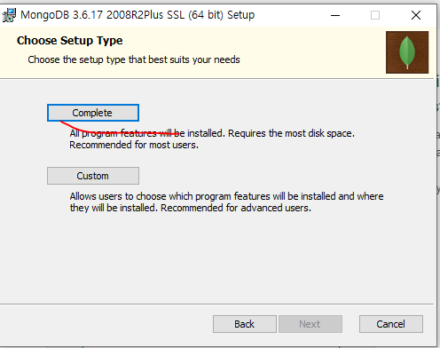
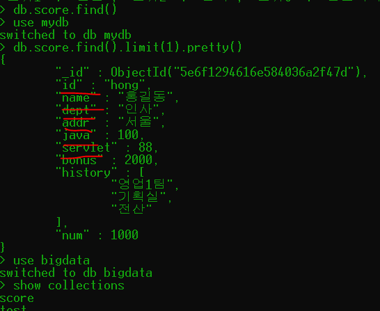

# MongoDB -> NoSQL

## NoSQL(Not Only SQL)

* 특징
  * Oracle 로 만들때는 schema가 필요하다
  * 그러나 NoSQL은 ''비정형데이터''이기에 schema가 없다
  * jSON
  * join을 할 수가 없다. 하나의 문서 안에 모든 데이터가 다 들어간다.
  * schema가 정해져 있어서 테이블이 늘어나고 조인이 복잡해진다.
  * MEAN 스택 기반이다.
  * 입출력이 빈번한 것들을 작업할때 MEAN스택 기반으로 구현을 해준다.

* 사용목적
  * RasberriPi는 debian 계열이라서 MongoDB 설치하고 센서데이터를 관리할 수 있다.
* 설치방법


빨간줄 되어있는 링크를 선택해준다.

아래와 같이 3.6.17버전에 windows64버전 선택해주고 package는 MSI 선택해준다.


그리고 다운받은 파일의 오른쪽을 클릭하고 속성으로 들어가면 아래와 같은 디스크 크기를 가지고 있다.


complete버전 선택해주고 install MongoDB compass 체크해준 다음 설치해준다.




* 설정 방법


위와 같은 순서로 해서 환경변수에 들어가서 (path)경로를 설정해준다.

그 다음에 win + R → cmd로 들어간다.


이렇게 mongod를 치고 들어가면 에러가 발생한다.

data를 DB 저장할 폴더가 없기 때문이다.

내부에서 발생하는 데이터를 폴더 하나에 저장한다.

그래서 아래와 같이 만들고 명령어 치면 아래와 같이 서버가 대기상태에 들어간다.

mongod -dbpath C:\iot\bigdata\mongodata


이 상태에서 새로운 명령 프롬프트에서 


위 그리고 아래와 같이 접속한다.


그러면 아래와 같이 서버에 뜬다.

또 웹 브라우저에서 http://127.0.0.1:27017/이렇게 접속하면


이렇게 메시지가 뜨고 아래 conn4처럼 메시지가 뜬다.


그리고 여러개 사용해서 접속하면 위와같이 메시지가 뜨고 다중 접속이 위와 같이 가능하다.

그리고 웹 사이트 document에서 다음과 같이 접속하는 방법을 살펴볼 수 있다.


### <<명령어>>

* 현재 만들어진 db 확인하기

show dbs;

* database 생성하기

use mydb;

* db 상태 확인할 때

db.stat()

db.stats()

* db logout할때

db.logout()


### <<용어>>

* collection(table): 테이블

* document(record): 레코드

* field(column): 컬럼

* _id: 기본키


위와 같이 db 상태를 확인할 수 있다.


use mydb; => 계정 생성

db.createCollection("test") = create table test ~~

test: 컬렉션명(table명)

show collections; = select * from tab;

1. #### Collection (rdbms에서 테이블)

=> 관계형 DB처럼 schema를 정의하지 않는다.


1) 종류

- capped collection

:고정 사이즈를 주고 생성하는 컬렉션

미리 지정한 저장공간이 모두 사용이 되면

맨 처음에 저장된 데이터가 삭제되고 공간으로 활용

* non cappped collection

:일반적인 컬렉션

Mongo DB는 기본으로 안 올라가 있다.
그러므로 path를 지정해주어야 한다.

mongod -dbpath C:\iot\bigdata\mongodata
Sharding이란 hadoop 처럼 분산저장이 가능하게 해 주는 역할을 해준다.

2)  collection관리

[생성]

db.createCollection("컬렉션명")  -> 일반 collection

=> 각각의 옵션을 설정해서 작업(json)


db.createCollection("컬렉션명",{옵션list})


위와 같이 collection을 생성한 후


위와 같이 확인 가능하다.

[삭제]

db.collection명.drop()


테이블 삭제는 위와 같이 사용할 수 있다.

[컬렉션명 변경]

db.컬렉션명.renameCollection("변경할컬렉션명");


테이블 이름을 바꿀때는 위와 같이 사용할 수 있다.

[실습]

mini 데이터베이스 생성

-use mini

emp (size: 10000, capped 컬렉션)

-db.createCollection("emp"

​	{capped:true, size:10000});

shop(일반컬렉션)

-db.createCollection("shop") 


생성한 collection이 capped인지 non capped인지 확인할 때

데이터베이스 목록,컬렉션 목록을 캡쳐

show dbs;

show collections;

컬렉션 validate()화면캡쳐

2.mongodb에 insert


[구문]

db.컬렉션명.insert({데이터...})

db.컬렉션명.insertOne({데이터...})

db.컬렉션명.insertMany({데이터...})

-document(관계형 db에서 레코드 개념)에 대한 정보는 json의 형식으로 작성

-mongodb에서 document를 삽입하면 자동으로 

_id 생성 -기본키 역할

"_id": ObjectId("5e6ee81606be3da41efd0467")

​						----------------------------------------------

현재 timestamp + machine Id + mongodb프로세스id + 순차번호

​																								-------------

​																							추가될 때마다 증가


* 스카마가 있는지 없는지 확인

  

arguments(매개변수)에 있는 것들은 생략 가능하다. 

#### MongoDB 데이터 자료형

MongoDB는 해당 데이터의 type를 1~255사이의 ID값을 부여하여 정의한다.

다음은 몽고DB에서 지원하고 있는 자료형의 목록이다.

| 형식            | 숫자 | 형식                     | 숫자 |
| --------------- | ---- | ------------------------ | ---- |
| 실수형(Double)  | 1    | 정규표현식               | 11   |
| 문자열(String)  | 2    | 자바스크립트             | 13   |
| 객체            | 3    | 심볼(Symbol)             | 14   |
| 배열            | 4    | 자바스크립트(with scope) | 15   |
| 바이너리 데이터 | 5    | 32비트 정수형            | 16   |
| 객체 ID         | 7    | 타임스템프               | 17   |
| 불린(Boolean)   | 8    | 64비트 정수형            | 18   |
| 날짜(Date)      | 9    | Min키                    | 255  |
| 널(Null)        | 10   | Max키                    | 127  |

#### MongoDB 구조

간단하게 MongoDB 구조를 정리하면 다음과 같다


그러나 필요할 경우, 도큐먼트 내부에도 복수의 도큐먼트를 포함시킬 수 있어 형식이 매우 자유롭다.


여기서 위와 같이 삽입을 하고


위와 같이 확인할 수 있다.


insert는 아래와 같이 할 수도 있다.


여러개를 한꺼번에 넣을때 배열로 삽입하면 된다.


그러면 위와 같이 확인 가능하다.


위와같이 중복해서 값을 넣으려고 하면 위와 같은 에러가 발생한다.


db.customer.insert({id:"kang",pass:"3456",name:"강감찬",
		info:{city:["seoul","busan","sejong"],
		toeicjumsu:[700,800,650,850,855]
		}
		});

db.customer.insert({id:"jang",pass:"1234",name:"장동건",
		info:{city:["인천","안산","안양"],
		toeicjumsu:[555,780,650,900,855]
		}
		});

db.customer.insert({id:"hong",pass:"2345",name:"홍길동",
		info:{city:["수원","파주","교하"],
		toeicjumsu:[480,540,656,770,820]
		}
		});

db.customer.insert({id:"park",pass:"5678",name:"박서준",
		info:{city:["부산","인천","안양"],
		toeicjumsu:[450,500,558,850,950]
		}
		});

db.customer.insert({id:"ha",pass:"6789",name:"하정우",
		info:{city:["파주","서울","안산"],
		toeicjumsu:[700,800,860,870,890]
		}
		});

3. mongodb에 update

-> document수정

-> 조건을 적용해서 수정하기 위한 코드로 json으로 구현


[update를 위한 명령어]

$set: 해당필드의 값을 변경(업데이트를 하기 위한 명령어)

none cappped collection인 경우 업데이트할 필드가 없는 경우 추가한다.

$inc: 해당필드에 저장된 숫자의 값을 증가

$unset: 원하는 필드를 삭제할 수 있다.

업데이트 옵션:

​		multi => true를 추가하지 않으면 조건에 만족하는

​		document 중 첫 번째 document만 update

[구문]

db.컬렉션명.update({조건필드:값},//sql의 update문 where절

​									{$set:{수정할필드:수정값}});//set절

​									{update와 관련된 옵션: 옵션값});


db.collection명.update({조건},{$set:{ }},{옵션});


[실습]

1. id가 kang사람의 dept를 "총무"로 변경

2. dept가 "전산"인 모든 addr을 "안양"으로 변경

3. id가 jang인 document의 bonus를 1000 추가하기

4. dept가 "인사"인 모든 document의 bonus에 2000을 추가하기

1. db.score.update({id:"kang"},{$set:{dept:"총무"}});
2. db.score.update({dept:"전산"},{$set:{addr:"안양"}},{multi:true});
3. db.score.update({id:"jang"},{$inc:{bonus:1000}});
4. db.score.update({dept:"인사"},{$inc:{bonus:2000}},{multi:true});


4. mongodb에서 배열 관리

db.score.update({id:"jang"},

​								{$set:

​									{info:

​											{city:["서울","안양"],

​										 	movie:["겨울왕국2","극한직업","쉬리"]

​											}

​									}

​								})

[배열에서 사용할 수 있는 명령어]

$addToSet: 배열의 요소를 추가

:없는 경우에만 값을 추가, 중복을 체크

 literal을 추가할 때 사용한다.

db.score.update({id:"jang"},

​		{$addToSet:{"info.city":"인천"}}

)

$push

배열의 요소를 추가

:중복을 허용

db.score.update({id:"jang"},

​		{$push:{"info.city":"천안"}}

)

$pop

배열에서 요소를 제거할 때 사용

1이면 마지막 요소를 제거,

-1이면 첫 번째 요소를 제거

db.score.update({id:"jang"},

​		{$pop:{"info.city":1}}

)

db.score.update({id:"jang"},

​		{$pop:{"info.city":-1}}

)

$each: addToSet이나 push에서 사용할 수 있다.

여러 개를 배열에 추가할 때 사용

db.score.update({id:"jang"},

​				{$push:

​						{"info.city":

​							{$each:["천안","가평","군산"]}

​						}

​				}

​	);

$sort: 정렬(1.오름차순 정렬, -1:내림차순 정렬)

db.score.update({id:"jang"},

​				{$push:

​						{"info.city":

​							{$each:["천안","가평","군산"],

​							 $sort:1

​							}

​						}

​				}

​	)


db.score.update({id:"jang"},

​				{$push:

​						{"info.city":

​							{$each:["창원","마산","태백"],

​							 $sort:1

​							}

​						}

​				}

​	)

$pull : 배열에서 조건에 만족하는 요소를 제거(조건을 한 개)

db.score.update({id:"jang"},

​				{$pull:{"info.city":"천안"} }

)

$pullAll : 배열에서 조건에 만족하는 요소를 제거(조건을 여러 개)

db.score.update({id:"jang"},

​				{$pullAll:{"info.city":["가평","군산"]} }

)

**score collection을 이용해서 작업해보세요**

**1. song,jang,hong에 다음과 같은 값을 가질 수 있도록 배열로 필드를 추가하세요**

**song : history (영업1팀, 총무, 기획실)**

**jang: history(전략팀,총무,전산)**

**hong : history(영업1팀, 기획실,전산)**

**2. song의 document history에 자금부를 추가하세요**

**3. jang의 document의 history에 마지막 데이터를 제거하세요**

**4. servlet데이터가 100점인 모든 document에 bonus를 3000을 추가하세요. 기존데이터가 존재하면 증가되도록 구현하세요**

**5. song의 lang.ms에 "visual basic","asp",".net"을 한꺼번에 추가하세요**

1.
db.score.update({id:"song"},
	{$addToSet:
		{"history":

		{$each:["영업1팀","총무","기획실"]}
	
		}
	
	}

);

db.score.update({id:"jang"},
	{$addToSet:
		{"history":

		{$each:["전략팀","총무","전산"]}
	
		}
	
	}

);

db.score.update({id:"hong"},
	{$addToSet:
		{"history":

		{$each:["영업1팀","기획실","전산"]}
	
		}
	
	}

);

2.

db.score.update({id:"song"},
	{\$addToSet:{"history":"자금부"}}
);
3.
db.score.update({id:"jang"},
	{​\$pop:{"history":1}}
);
4.
db.score.update({servlet:100},
	{\$inc:{"bonus":3000}},
	{multi:true});
5.
db.score.update({id:"song"},
	{\$addToSet:
		{"lang.ms":
			{\$each:["visual basic","asp",".net"]}
		}
	}
);


게시물과 댓글을 mongodb에 저장
use mydb;
1. board 컬렉션을 생성
db.createCollection("board");

2. document는 5개 insert

no,id,title,content,count,writedate

db.board.insert({no:1,id:"kang",title:"게시글1",content:"안녕하세요1",count:10,writedate:new Date});
db.board.insert({no:2,id:"jang",title:"게시글2",content:"안녕하세요2",count:20,writedate:new Date});
db.board.insert({no:3,id:"hong",title:"게시글3",content:"안녕하세요3",count:30,writedate:new Date});
db.board.insert({no:4,id:"park",title:"게시글4",content:"안녕하세요4",count:40,writedate:new Date});
db.board.insert({no:5,id:"lee",title:"게시글5",content:"안녕하세요5",count:50,writedate:new Date});


3. 2번째 게시물에는 댓글이 3개 추가되도록

update - 하위object와 배열로 구성

댓글의 필드
content,count1,count2,writedate

=> 코드와 실행결과 캡쳐

db.board.update({id:"jang"},
		{\$addToSet:
			{comment:[
				{content:"내용1",count1:1, count2:2,writedate:new Date}
			]}
		}
	);
db.board.update({id:"jang"},
		{\$push:
			{comment:[
				{content:"내용2",count1:2, count2:0,writedate:new Date}
			]}
		}
	);
db.board.update({id:"jang"},
		{\$push:
			{comment:[
				{content:"내용3",count1:1, count2:3,writedate:new Date}
			]}
		}
	);


db.board.update({no:3},
		{\$push:
			{comment:
				{content:"댓글내용",

​				 count1:10,

​                 count2:1,

​                 writedate:new Date()}
​			}
​		}
​	)

화면 클리어 하는 명령어: cls

db.board.find().pretty()


### 5. Mongodb에 저장된 데이터 조회하기 - find()


이렇게 명령문을 javascript 변수에 넣을 수 있다.

또 x변수에 선언한 score 테이블에 num이란 컬럼이랑 120이란 리터럴을 삽입해준다.


db.score.insert(x)에서 에러가 나는 이유: primary key가 중복되기 때문이다.

db.score.save(x): 값이 원래 없던거면 insert를 해주는 거고 원래 값이 있었으면 update 역할을 해준다.

db.score.find().count(): score 테이블에 document(레코드) 개수를 말한다.


[실습1]

score의 모든 document에 num필드(1000)가 추가되도록 작업

모든 document에 num이란 컬럼이 추가되게 해줄 것


실행결과 보기


1) find

db.컬렉션명.find(조건, 조회할 필드에 대한 명시)

-db.컬렉션명.find({})와 동일

:{}안에 아무것도 없으면 전체 데이터 조회

-조건, 조회할 필드에 대한 명시 모두 json

-조회할 필드의 정보 명시

형식:{필드명:1...}: 화면에 표시하고 싶은 필드

​         {필드명:0}: 명시한 필드가 조회되지 않도록 처리

[조건]

$lt: \< (less than) 주어진 값과 일치하는 값

$gt: \> (greater than) 주어진 값보다 큰 값

$lte: \<= (less than or equals) 주어진 값보다 작거나 같은 값

$gte: \>= (greater than or equals) 주어진 값보다 크거나 같은 값

$ne: (not equal) 주어진 값과 일치하지 않는 값

-addr이 인천인 데이터: id, name, dept, addr

db.score.find({addr:"인천"},{id:1,name:1,dept:1,addr:1,_id:0})


-score컬렉션에서 java가 90점 이상인 document조회

id,name,dept,java만 출력할 것

db.score.find({java:{$gte:90}},{id:1,name:1,dept:1,java:1,_id:0})


$or - 여러 필드를 이용해서 같이 비교 가능하다

$and - and 연산

$in - 하나의 필드에서만 비교| 주어진 배열 안에 속하는 값

$nin - not in | 주어진 배열 안에 속하지 않는 값

$in으로 정의한 조건을 제외한 document를 조회


-dept가 인사이거나 addr이 인천인 데이터 조회

db.score.find({$or:[{dept:"인사"},

​								  {addr:"인천"}]})

-id가 song, kang, hong인 데이터 조회

db.score.find({$or:[{id:"song"},

​								  {id:"hong"},

​								  {id:"kang"}]})


db.score.find({id:{$in:["song","hong","kang"]}})


-id가 song, kang, hong이 아닌 데이터 조회

db.score.find({id:{$nin:["song","hong","kang"]}})

-id 구분 위하여 데이터 하나 추가하기

db.score.insert({id:"hong123",name:"홍길동",dept:"인사",addr:"서울",java:100,servlet:88})


2) 조회메소드

-findOne(): 첫 번째 document만 리턴

-find(): 모든 document 리턴

-count():행의 갯수를 리턴

-sort({필드명:sort옵션}): 정렬

​											1 => 오름차순

​											-1 => 내림차순

-limit(숫자): 숫자만큼의 document만 출력

-skip(숫자): 숫자만큼의 document를 skip하고 조회

db.score.find().sort({id:1}); //id 기준 오름차순

db.score.find().sort({java:-1}); //java 기준 내림차순

db.score.find().limit(5);

db.score.find().skip(5);

3) 정규표현식을 적용

db.컬렉션명.find({조건필드명:/정규표현식/옵션})

db.score.insert({id:"KIM",pass:"1234"})

^ 데이터 삽입

[기호]

|: or

^: ^뒤의 문자로 시작하는지 체크

\$: \$앞의 문자가 있는지 체크

\[ \]: 영문자 하나는 한 글자를 의미하고 []로 묶으면 여러 글자를 표현한다.

\[a-i\]: a에서 i까지의 모든 영문자

[옵션]

i: 대소문자 구분없이 조회 가능


-id가 kim과 park인 document조회

db.score.find({id:/kim|park/})

db.score.find({id:/kim|park/i}) 이러면 id가 대문자인 'KIM' 도 조회된다.

-id가 k로 시작하는 document조회

db.score.find({id:/^k/})

db.score.find({id:/^k/i})

-[a-i]까지 영문이 있는 id를 조회 a,b,c,d,e,f,g,h,i

db.score.find({id:/[a-i]/})

-id가 k-p로 시작하는 document 조회 k,l,m,n,o,p

db.score.find({id:/^[k-p]/})

-id에 a와 i가 있는 document 조회하는 작업

db.score.find({id:/[ai]/}) a가 있거나 i가 있는 것들을 찾아내기

db.score.find({id:/[kp]/}) k가 있거나 p가 있는 것들을 찾아내기

### 6. Mongodb에 저장된 데이터 조회하기 - remove()

-조건을 정의하는 방법은 find()나 update()와 동일

```bash
> db.score.find().count();
14
> db.score.remove({servlet:{$lt:80}});
WriteResult({ "nRemoved" : 2 })
> db.score.find().count();
12
```

​	db.score.remove({servlet:{$lt:80}});

#### $regex 연산자

{ \<field>: /pattern/\<options>} 이런 형태로 정규표현식으로 쿼리를 날릴 수 있다.

* i: 대소문자 무시
* m: 정규식에서 anchor(^)를 사용할 때 값에 \n이 있다면 무력화
* x: 정규식 안에있는 whitespace를 모두 무시
* s: dot (.) 사용할 때 \n을 포함해서 매치

db.articles.find({"title": /article0[1-2]/ })

#### $where 연산자

$where 연산자를 통해 javascript expression을 사용할 수 있다.

db.articles.find({$where: "this.comments.length == 0"})

#### $elem Match 연산자

$elem Match 연산자는 Embedded Documents 배열을 쿼리할 때 사용한다.

http://blog.naver.com/PostView.nhn?blogId=2_ten&logNo=220507274312&categoryNo=65&parentCategoryNo=0&viewDate=&currentPage=1&postListTopCurrentPage=1&from=postView

https://psyatreion.tistory.com/498


투표: 30%
코드내용: 50%
-기능이 얼마나 많이 구현되었는지
-수업시간에 배운 내용이 충실하게 구현되었는지
-open api를 사용해서 새로운 기능에 도전했는지
-실무에서 사용할 수 있는 형태를 고민해서 구현했는지
-발표할 때 에러없이 실행되었는지

협업: 20%

[mongodb_find]

1. Score collection에서 이름과 주소와 servlet점수를 출력해보자
  db.score.find({},{name:1,addr:1,servlet:1,_id:0}).pretty()

2. Score collection에서 java점수 중 70점 이상을 출력해보자
  db.score.find({java:{$gte:70}}).pretty()

3. Score collection에서 이름, java점수를 출력하고 bonus가 2000이상n
  인 사람만 출력해보자
  db.score.find({bonus:{$gte:2000}},{name:1,java:1}).pretty()

4. score에서 dept가 인사이면서 addr이 안양이거나 대구인 document 출력
  db.score.find({$and:[{dept:"인사"},{addr:{$in:["안양","대구"]}}]})

5. servlet이 70에서 90사이이며 dept가 총무인 document 조회
  db.score.find({$and:[{dept:"총무"},{servlet:{$gte:70,$lte:90}}]})

6. score에서 이름에 김씨인 사람 조회해보기
  db.score.find({id:/^kim/})

7. score에서 servlet점수가 가장 낮은 document와 가장 높은 document 출력하기
  db.score.find({}).sort({servlet:-1}).limit(1)
  db.score.find({}).sort({servlet:1}).limit(1)

8. java점수가 가장 높은 document중에 7개를 출력하되 2개를 건너뛰고 출력해보자
  db.score.find({}).sort({java:1}).skip(2).limit(7)

9. 아이디에 n과 o가 들어가는 것 구하기
  db.score.find({id:/n|o/})

  db.score.find({id:/n/,id:/o/})

db.score.find({servlet:{$exists:null}})

db.score.find({servlet:{$not:{$exists:null}}}).sort({servlet:1}).limit(1);


## 7.MongoDB에서 Aggregation

-group by 와 동일개념

-간단한 집계를 구하는 경우 mapreduce를 적용하는 것보다 간단하게 작업한다.

-Pipeline을 내부에서 구현

한 연산의 결과가 또 다른 연산의 input 데이터로 활용한다.

https://docs.mongodb.com/v3.6/core/aggregation-pipeline/

의 그림을 살펴볼 것

#### 1) 명령어(RDBMS와 비교)

$match: where절, having절

$group: group by

$sort: order by

$avg: avg그룹함수

$sum: sum그룹함수

$max: max그룹함수

[형식]

db.컬렉션명.aggregate(aggregate명령어를 정의)

​										------------------------------------

​										여러 가지를 적용해야 하는 경우 배열

$group:{_id: 그룹으로 표시할 필드명, 연산결과를 저장할 필드명:{연산함수:값}}

​																											----------------

​																											숫자나 필드참조

$match:{필드명:{연산자:조건값}}

​				----------------------------------

​                 비교연산 or 조건이 여러 개

-addr별 인원수

db.exam.aggregate([{$group:{_id:"$addr",num:{$sum:1}}

​									}]);

//1씩 더해진다.

-dept별 인원수

db.exam.aggregate([{$group:{_id:"$dept",num:{$sum:1}}

​									}]);

-dept별 java점수의 평균

db.exam.aggregate([{$group:{_id:"$dept",avg_java:{$avg:"$java"}}

​									}]);

-addr별 servlet 합계

db.exam.aggregate([{$group:{_id:"$addr",sum_servlet:{$sum:"$servlet"}}

​									}]);

-dept별 java점수의 평균, 단 addr이 인천인 데이터만 작업

$match를 추가

db.exam.aggregate([

​								{$match:{addr:"인천"}},

​								{$group:{_id:"$dept"

​										,평균:{\$avg:"$java"}}

​									}]);


#### mongodb_Aggregation Framework활용하기

1. dept가 인사인 document의 servlet평균 구하기
db.exam.aggregate([
	{\$match:{dept:"인사"}},
	{\$group:{_id:"$dept",평균:{$avg:"$servlet"}}}
])

2. java가 80점이 넘는 사람들의 부서별로 몇 명인지 구하기
db.exam.aggregate([
	{\$match:{java:{\$gt:80}}},
	{\$group:{_id:"$dept",부서별인원수:{\$sum:1}}}
])

3. 2번 결과를 인원수데이터를 내림차순으로 정렬해 보세요.
db.exam.aggregate([
	{\$match:{java:{\$gte:80}}},
	{\$group:{_id:"\$dept",'부서별인원수':{\$sum:1}}},
	{\$sort:{'부서별인원수':-1}}
])

```bash
> db.exam.aggregate([
... {$match:{dept:"인사"}},
... {$group:{_id:"$dept",평균:{$avg:"$servlet"}}} 
... ])
{ "_id" : "인사", "평균" : 90.2 }
> db.exam.aggregate([
... {$match:{java:{$gt:80}}},
... {$group:{_id:"$dept",부서별인원수:{$sum:1}}}
... ])
{ "_id" : "총무", "부서별인원수" : 1 }
{ "_id" : "전산", "부서별인원수" : 4 }
{ "_id" : "인사", "부서별인원수" : 3 }
>
>
> 3. 2번 결과를 인원수데이터를 내림차순으로 정렬해 보세요.
> db.exam.aggregate([
... {$match:{java:{$gt:80}}},
... {$group:{_id:"$dept",num:{$sum:1}}},
... {$sort:{num:-1}}
... ])
{ "_id" : "전산", "부서별인원수" : 4 }
{ "_id" : "인사", "부서별인원수" : 3 }
{ "_id" : "총무", "부서별인원수" : 1 }
>
```


https://docs.spring.io/spring-data/mongodb/docs/2.1.16.RELEASE/reference/html/#repositories.core-concepts


Project name: mongoTest


spring.data.mongoTest 입력할 것


sqoop rdbms의 제어이기에 하지 못한다.

mongodb의 데이터를 가지고 와서 해 주어야 한다.

pom.xml에 라이브러리 등록

 mydb에 접속하기 위해서 설정해 주어야 한다.


설정파일을 이렇게 설정해준다. 


빨간줄이 mongoDB 서버 접속 포트이다.


위와 같이 mongoDB에서 설정해준다.


스키마가 없는 곳에서 작성한다는 점이

오버헤드가 많아진다는 점이다.

그리고 머신에 부담을 줄여주기 위해 데이터를 넣을때 update보다는 insert를 많이 사용한다. 그리고 json 베이스라는 점이 매력적이다.


데이터가 없으면 위처럼 0개의 레코드가 추출되었다는 메시지가 뜬다.

그래서 메시지를 추출하고 싶으면 아래와 같이 컬렉션에 데이터가 있는 db에 대해서 접근해야 아래와 같이 값이 export될 수 있다.

 


위와 같이 파일을 import한다.


mongoimport에서 -하이픈 데신에 /를 사용한 이유가 version이 업데이트 되면서 사용방법이 바뀌었기 때문이다.

-d 실행할 데이터베이스의 이름을 지정한다.

-c import할 collection을 지정한다.

-type 가져올 파일형식을 지정한다. 기본형식은 JSON이지만 .csv 및 .tsv 파일을 가져올 수있다. 

-file 가져올 데이터가 들어있는 파일의 위치와 이름을 지정한다. 파일을 지정하지 않으면 mongoimport가 표준 입력에서 데이터를 읽는다.

-headerline -type csv 또는 -type tsv를 사용하는 경우 첫 번째 로우를 필드 이름으로 사용한다. 그렇지 않으면 mongoimport가 오류를 반환한다. -headerline은 csv 또는 tsv 가져오기에만 사용된다.

https://blog.naver.com/theswice/220946017455

mongoimport관련 개념 정리된 블로그

import된 db 확인하는 방법


위와 같이 설정해 주어야 한다.




위의 빨간색 요소들 선택


이렇게 위와 같이 설정해준다.


RDBMS는 그냥 jdbc 쓰면 된다.

하지만 NoSQL은 조금 특수한 사항이기에 조금 사용방법이 다르다.

1,2,4,5,6,8,9,11,12,13,14 은 최소 한 번씩은 써볼 것


여기 4개는 관계형 데이터베이스이다.

ElasticSearch도 급격히 상승하였다.

Solr는 검색에 사용


데이터 하나를 삭제할 때 위와같이 설정해 주어야 한다.

...은 여러 조건이 가능하다