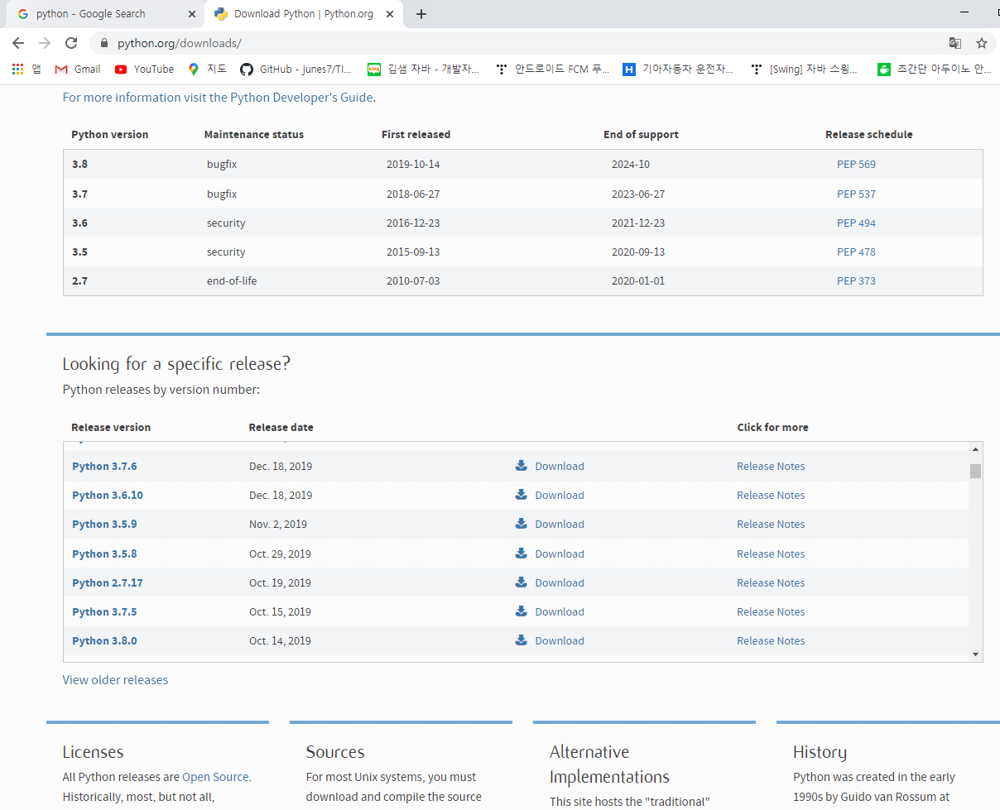
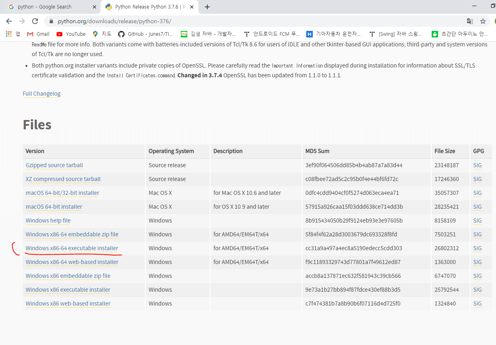
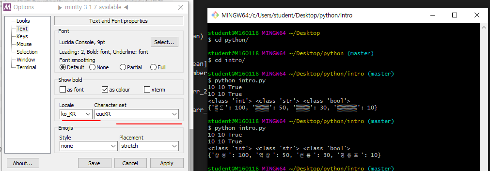
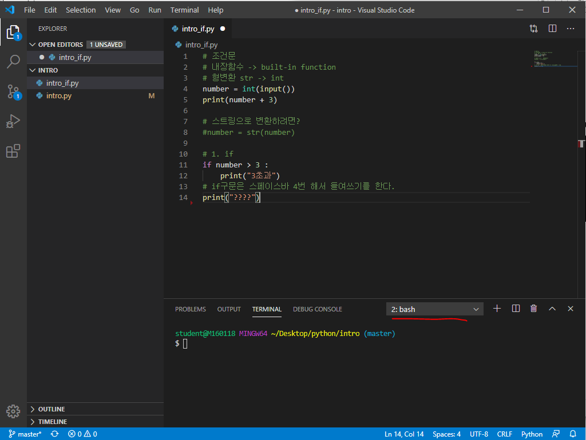
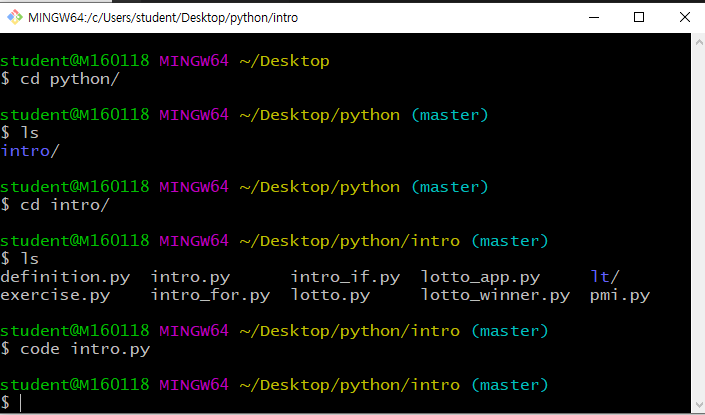
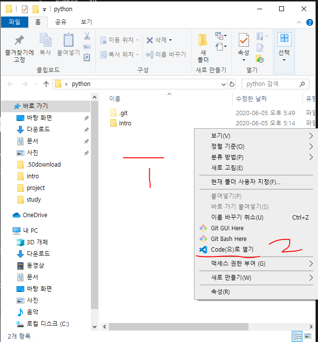
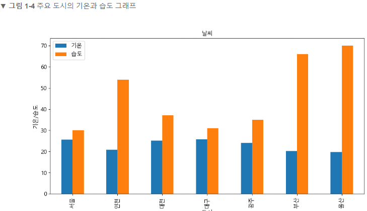

# Python 설치방법





여기서 밑에 빨간줄 그어진 버전을 다운 받는다.



Visual Studio Code에서 파이썬 파일을 생성하는 방법

code intro.py

github 파는 방법


http://bit.ly/3ckmCUZ

python execution

python intro.py




한글 깨짐을 극복하기 위해 왼쪽과 같이 설정해준다.


vscode에서 터미널 이용하는 방법


ctrl + shift + ` 터미널 여는 key




빨간줄 부분 선택해서 Select Default Shell -> git bash 선택


code 는 vscode에서만 사용할 수 있다.

chrome extension에서 json viewer 설치


pip install requests


* 위의 explorer list에 파일들을 띄우는 방법

$ 첫 번째 방법: File → Open Folder → 열고 싶은 폴더의 상위 폴더를 선택해주면 열고 싶은 폴더 안의 파일 list를 explorer에 띄울 수 있다. 


$ 두 번째 방법 → bash에서 아래와 같이 원하는 폴더로 접근하여 code 파일명을 입력하여 파일을 연다.



$ 세 번째 방법: 아래와 같이 window 탐색기에서 폴더를 열어서 오른쪽 클릭하고 메뉴 리스트에서 Code(으)로 열기를 눌러 실행해준다.



참고 문헌

예제로 배우는 파이썬 프로그래밍

http://pythonstudy.xyz/

공공데이터 open API

https://www.data.go.kr/data/15057411/openapi.do

강사님 github 주소

https://github.com/edu-sk

Python tutor

http://www.pythontutor.com/visualize.html#mode=edit

동행복권

https://www.dhlottery.co.kr/common.do?method=getLottoNumber&drwNo=1

파이썬 코딩 도장

https://dojang.io/mod/page/view.php?id=2269


* 날씨 데이터를 그래프로 그리는 문제

기상청 웹 사이트의 날씨 데이터를 그래프로 그리는 문제이다. 다음과 같이  주요 도시의 기온과 습도를 막대 그래프로 나타낸다.

1. 기상청 웹 사이트에서 데이터가 어디에 어떻게 표시되는지 알아야 한다.
2. 보통 웹 사이트는 html언어로 글자와 그림을 이용해 구성, 우리는 HTML을 분석하여 도시 이름, 기온, 습도 값이 저장된 위치를 찾는다.
3. 그 다음에 분석된 정보를 토대로 HTML에서 기온과 습도 정보를 가져와 정형화된 데이터로 만든다. 그리고 데이터 중에서 특별시와 광역시만 추출한 뒤 막대 그래프로 그리면 된다.




* 선형 보간법: 끝점의 값이 주어졌을 때 그 사이에 위치한 값을 추정하기 위하여 직선 거리에 따라 선형적으로 계산하는 방법이다.

```java
//p1, p2를 d1:d2로 분할하는 p를 리턴한다.
float lerp(float p1, float p2, float d1){
    return (1-d1)*p1 + d1*p2;
}
```


휴대폰이나 카메라로 사진을 찍으면 JPG라는 확장자로 저장된다. 이 JPG(JPEG)가압축 알고리즘을 구현한 포맷이다. 이 사진을 그대로 저장하면 용량이 너무 커서 저장 공간이 금방 차버리겠지만 압축을 해서 저장하면 많은 사진을 보관할 수 있다. 휴대폰이나 카메라를 가진 사람들은 모두 이용하는 알고리즘이다.

긴 문자열을 압축할 때는 반복되는 문자의 횟수를 적어주고, 해제할 때는 숫자만큼 문자를 반복해주자고 약속하면 된다. 컴퓨터에서 쓰이는 압축 알고리즘도 이러한 형태고 이 방식을 Run-Length Encoding, RLE라고 하며 PCX 그림 파일 포맷에 쓰인다. 요즘은 좀 더 다양한 상황에 대응하고 압축 효율을 높이가 위해 훨씬 복잡한 알고리즘을 사용한다.)

문자 뒤에 반복되는 횟수를 적어주면 원래 데이터보다 길이가 짧아져서 공간 절약을 할 수 있다. 

서비스 


크롬 웹 브라우저

우리는 웹서비스를 개발한다. = 

우리는 서버 컴퓨터에서 요청과 응답 처리할 프로그램을 개발한다.

웹 페이지를 작성하기 위해 사용하는 언어

Hyper Text Markup Language

Hyper Text 누르면 넘어간다 | 

누르면 넘어가는 걸 주고받는 규칙

Hyper Text Transfer Protocol

Markup 쓰는 이유: 각 부분별 역할을 정확하게 하기 위해서


## 5. 자료 구조

### 5.1 리스트 더 보기

리스트 자료 형은 몇 가지 메서드들을 더 갖고 있다. 이것들이 리스트 객체의 모든 메서드 들이다.

#### list.append(x)

리스트의 끝에 항목을 더한다. a[len(a) : ] = [x] 와 동등하다

#### list.extend(iterable)

리스트의 끝에 이터러블의 모든 항목을 덧붙여서 확장한다. a[len(a) : ] = iterable와 동등하다.

#### list.insert(i, x)

주어진 위치에 항목을 삽입한다. 첫 번째 인자는 삽입되는 요소가 갖게 될 인덱스이다. 그래서 a.insert(0, x)는 리스트의 처음에 삽입하고, a.insert(len(a), x)는 a.append(x)와 동등하다.

#### list.remove(x)

리스트에서 값이 X와 같은 첫 번째 항목을 삭제한다. 그런 항목이 없으면 ValueError를 일으킨다.

#### list.pop([i])

리스트에서 주어진 위치에 있는 항목을 삭제하고, 그 항목을 돌려준다. 인덱스를 지정하지 않으면, a.pop()은 리스트의 마지막 항복을 삭제하고 돌려준다.

(메서드 시그니처에서 i를 둘러싼 대괄호는 매개변수가 선택적임을 나타낸다. 그 위치에 대괄호를 입력해야 한다는 뜻이 아니다. 이 표기법은 파이썬 라이브러리 레퍼런스에서 자주 등장한다.)

#### list.clear()

리스트의 모든 항목을 삭제한다. del a[ : ]와 동등하다.

#### list.index(x[,start[,end]])

리스트에 있는 항목 중 값이 X와 같은 첫 번째 것의 0부터 시작하는 인덱스를 돌려준다. 그런 항목이 없으면 ValueError를 일으킨다.

선택적인 인자 start와 end는 슬라이스 표기법처럼 해석되고, 검색을 리스트의 특별한 Sub Sequence로 제한하는 데 사용된다. 돌려주는 인덱스는 start인자가 아니라 전체 sequence의 시작을 기준으로 한다.

#### list.count(x)

리스트에서 x가 등장하는 횟수를 돌려준다.

#### list.sort(key=None, reverse=False)

리스트의 항목들을 제자리에서 정렬한다. (인자들은 정렬 커스터마이제이션에

사용될 수 있다. 설명은 sorted를 볼 것!!)

#### list.reverse()

리스트의 요소들을 제자리에서 뒤집는다.

#### list.copy()

리스트의 얕은 사본을 돌려준다. a[ : ]와 동등하다.