# Python 설치방법

여기 밑에서 3.7.6 버전을 찾아서 클릭해준다.


여기서 밑에 빨간줄 그어진 버전을 다운 받는다.


Visual Studio Code에서 파이썬 파일을 생성하는 방법

code intro.py

github 파는 방법


http://bit.ly/3ckmCUZ

python execution

python intro.py


한글 깨짐을 극복하기 위해 왼쪽과 같이 설정해준다.

vscode에서 터미널 이용하는 방법


ctrl + shift + ` 터미널 여는 key


빨간줄 부분 선택해서 Select Default Shell -> git bash 선택

code 는 vscode에서만 사용할 수 있다.

chrome extension에서 json viewer 설치


pip install requests


* 위의 explorer list에 파일들을 띄우는 방법

$ 첫 번째 방법: File → Open Folder → 열고 싶은 폴더의 상위 폴더를 선택해주면 열고 싶은 폴더 안의 파일 list를 explorer에 띄울 수 있다. 

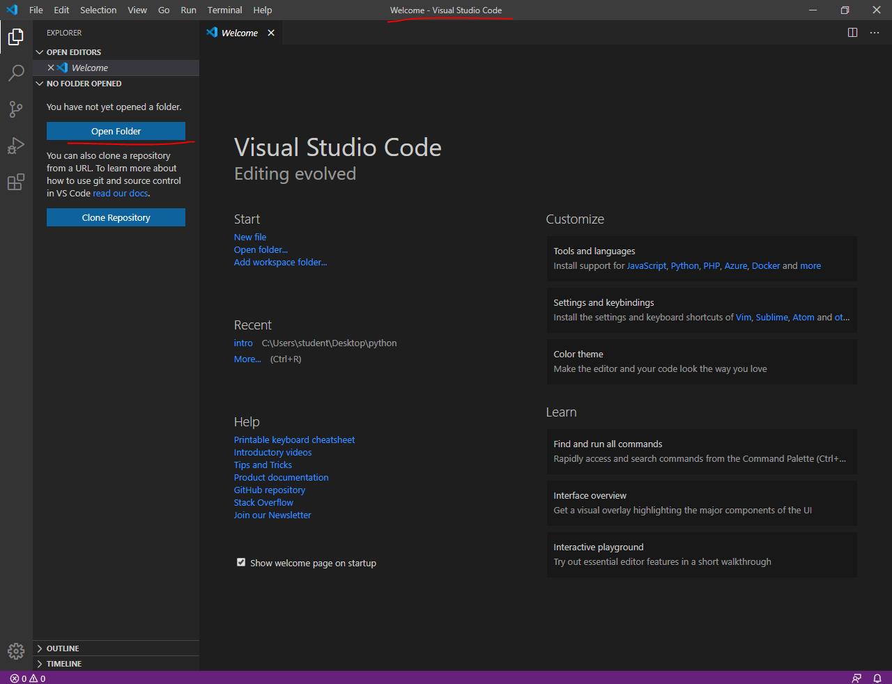

$ 두 번째 방법 → bash에서 아래와 같이 원하는 폴더로 접근하여 code 파일명을 입력하여 파일을 연다.


$ 세 번째 방법: 아래와 같이 window 탐색기에서 폴더를 열어서 오른쪽 클릭하고 메뉴 리스트에서 Code(으)로 열기를 눌러 실행해준다.


참고 문헌

예제로 배우는 파이썬 프로그래밍

http://pythonstudy.xyz/

공공데이터 open API

https://www.data.go.kr/data/15057411/openapi.do

강사님 github 주소

https://github.com/edu-sk

Python tutor

http://www.pythontutor.com/visualize.html#mode=edit

동행복권

https://www.dhlottery.co.kr/common.do?method=getLottoNumber&drwNo=1

파이썬 코딩 도장

https://dojang.io/mod/page/view.php?id=2269


* 날씨 데이터를 그래프로 그리는 문제

기상청 웹 사이트의 날씨 데이터를 그래프로 그리는 문제이다. 다음과 같이  주요 도시의 기온과 습도를 막대 그래프로 나타낸다.

1. 기상청 웹 사이트에서 데이터가 어디에 어떻게 표시되는지 알아야 한다.
2. 보통 웹 사이트는 html언어로 글자와 그림을 이용해 구성, 우리는 HTML을 분석하여 도시 이름, 기온, 습도 값이 저장된 위치를 찾는다.
3. 그 다음에 분석된 정보를 토대로 HTML에서 기온과 습도 정보를 가져와 정형화된 데이터로 만든다. 그리고 데이터 중에서 특별시와 광역시만 추출한 뒤 막대 그래프로 그리면 된다.


* 선형 보간법: 끝점의 값이 주어졌을 때 그 사이에 위치한 값을 추정하기 위하여 직선 거리에 따라 선형적으로 계산하는 방법이다.

```java
//p1, p2를 d1:d2로 분할하는 p를 리턴한다.
float lerp(float p1, float p2, float d1){
    return (1-d1)*p1 + d1*p2;
}
```


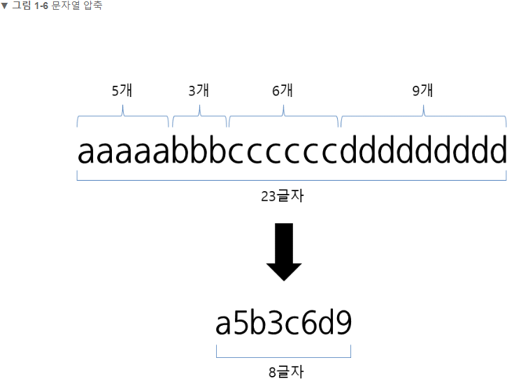

휴대폰이나 카메라로 사진을 찍으면 JPG라는 확장자로 저장된다. 이 JPG(JPEG)가압축 알고리즘을 구현한 포맷이다. 이 사진을 그대로 저장하면 용량이 너무 커서 저장 공간이 금방 차버리겠지만 압축을 해서 저장하면 많은 사진을 보관할 수 있다. 휴대폰이나 카메라를 가진 사람들은 모두 이용하는 알고리즘이다.

긴 문자열을 압축할 때는 반복되는 문자의 횟수를 적어주고, 해제할 때는 숫자만큼 문자를 반복해주자고 약속하면 된다. 컴퓨터에서 쓰이는 압축 알고리즘도 이러한 형태고 이 방식을 Run-Length Encoding, RLE라고 하며 PCX 그림 파일 포맷에 쓰인다. 요즘은 좀 더 다양한 상황에 대응하고 압축 효율을 높이가 위해 훨씬 복잡한 알고리즘을 사용한다.)

문자 뒤에 반복되는 횟수를 적어주면 원래 데이터보다 길이가 짧아져서 공간 절약을 할 수 있다. 

서비스 


크롬 웹 브라우저

우리는 웹서비스를 개발한다. = 

우리는 서버 컴퓨터에서 요청과 응답 처리할 프로그램을 개발한다.

웹 페이지를 작성하기 위해 사용하는 언어

Hyper Text Markup Language

Hyper Text 누르면 넘어간다 | 

누르면 넘어가는 걸 주고받는 규칙

Hyper Text Transfer Protocol

Markup 쓰는 이유: 각 부분별 역할을 정확하게 하기 위해서


* vscode 터미널과 스크립트 포커스 이동

ctrl + ` 터미널 이동

ctrl + 1 스크립트 이동


## 5. 자료 구조

### 5.1 리스트 더 보기

리스트 자료 형은 몇 가지 메서드들을 더 갖고 있다. 이것들이 리스트 객체의 모든 메서드 들이다.

#### list.append(x)

리스트의 끝에 항목을 더한다. a[len(a) : ] = [x] 와 동등하다

#### list.extend(iterable)

리스트의 끝에 이터러블의 모든 항목을 덧붙여서 확장한다. a[len(a) : ] = iterable와 동등하다.

#### list.insert(i, x)

주어진 위치에 항목을 삽입한다. 첫 번째 인자는 삽입되는 요소가 갖게 될 인덱스이다. 그래서 a.insert(0, x)는 리스트의 처음에 삽입하고, a.insert(len(a), x)는 a.append(x)와 동등하다.

#### list.remove(x)

리스트에서 값이 X와 같은 첫 번째 항목을 삭제한다. 그런 항목이 없으면 ValueError를 일으킨다.

#### list.pop([i])

리스트에서 주어진 위치에 있는 항목을 삭제하고, 그 항목을 돌려준다. 인덱스를 지정하지 않으면, a.pop()은 리스트의 마지막 항복을 삭제하고 돌려준다.

(메서드 시그니처에서 i를 둘러싼 대괄호는 매개변수가 선택적임을 나타낸다. 그 위치에 대괄호를 입력해야 한다는 뜻이 아니다. 이 표기법은 파이썬 라이브러리 레퍼런스에서 자주 등장한다.)

#### list.clear()

리스트의 모든 항목을 삭제한다. del a[ : ]와 동등하다.

#### list.index(x[,start[,end]])

리스트에 있는 항목 중 값이 X와 같은 첫 번째 것의 0부터 시작하는 인덱스를 돌려준다. 그런 항목이 없으면 ValueError를 일으킨다.

선택적인 인자 start와 end는 슬라이스 표기법처럼 해석되고, 검색을 리스트의 특별한 Sub Sequence로 제한하는 데 사용된다. 돌려주는 인덱스는 start인자가 아니라 전체 sequence의 시작을 기준으로 한다.

#### list.count(x)

리스트에서 x가 등장하는 횟수를 돌려준다.

#### list.sort(key=None, reverse=False)

리스트의 항목들을 제자리에서 정렬한다. (인자들은 정렬 커스터마이제이션에

사용될 수 있다. 설명은 sorted를 볼 것!!)

#### list.reverse()

리스트의 요소들을 제자리에서 뒤집는다.

#### list.copy()

리스트의 얕은 사본을 돌려준다. a[ : ]와 동등하다.


* CLI 강의

-폴더 지울 때

rm -rf grammar

-폴더 생성할 때

mkdir gremmer

-폴더 이름 바꿀 때 

mv gremmer/ grammar


* 파이썬 서랍 안에 라이브러리를 가져오는 작업이 import이다.

* 파이썬 규칙 구현 사이트: https://www.python.org/dev/peps/pep-0008/#tabs-or-spaces

* YouTube Data API v3 계정 생성할 때 주의해야 될 부분

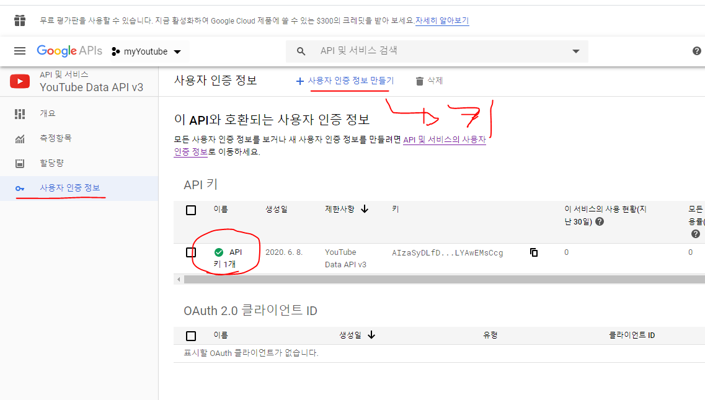

* 아래의 이 부분들도 체크해줄 것

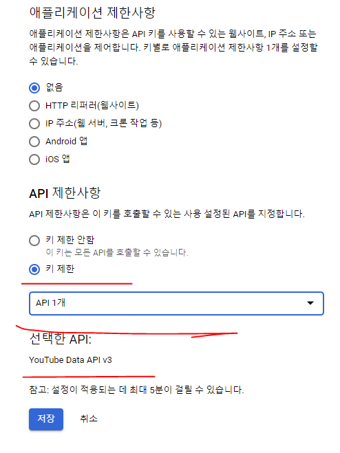

* 그리고 사용자 인증 정보와 OAuth 동의화면도 실행해준다.

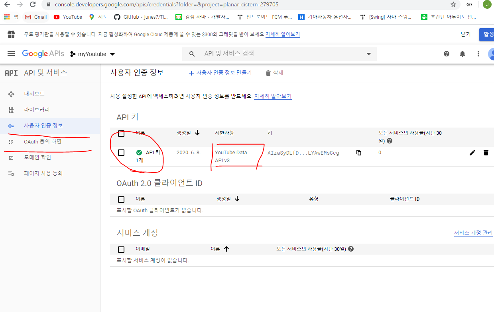

### Youtube Data API Search list

검색결과에는 API 요청에 지정된 검색 매개변수와 일치하는 YouTube동영상, 채널 또는 재생목록의 정보가 포함되어 있다. 검색결과는 동영상과 같이 고유하게 식별할 수 있는 리소스를 보여주지만, 자체적으로는 영구적 데이터를 가지지 않는다.


! tab을 누르면 전체 html요소가 다 만들어진다.

elastic search 같은 경우에는 우리가 더 쉽게 찾을 수 있는 내용들이 포함되어 있다.


### HTML은 정보와 구조화 | CSS는 styling 정의

아래의 설치를 통해 vscode에서 바로 구현한 웹 페이지 결과를 띄울 수 있다.

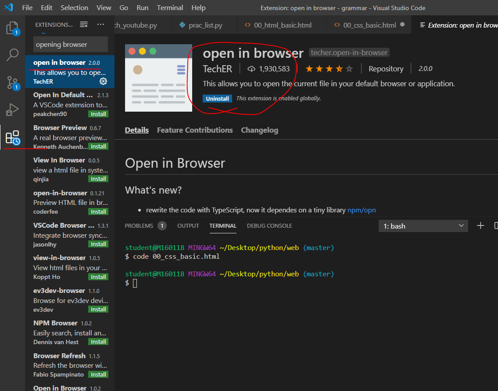

위와 같이 클릭해서 'open in browser'를 설치해준다. 그리고 alt + b 를 누르면 구현한 웹 페이지 결과를 볼 수 있다.


relative는 자기 자신이 있었던 위치를 고수하고 이동하는거고

absolute는 자기 자신이 있던 위치를 무시하고 새로 이동한다.

내 부모 속성들 중 static 이 아닌 부모를 기준으로 움직인다.


z-index는  z축의 값을 100으로 주어 3차원으로 뷰를 볼 수 있도록 해준다.

장미가족의 태그교실


CDN 활용을 통해 Bootstrap에 작성된

ctrl + shift + p 를 누르면 검색할 수 있는 창이 뜬다.

거기서 Preferences: open settings: json 가서 적용되는 탭 간격 설정을 적어준다.

* vs code 탭 간격 설정 검색해서 참고할 것!!

그리고 웹 페이지를 구현할 때 동일한 작업에 대해 동시에 처리하고 싶으면 ctrl + alt + ↓ (방향 키)를 눌러 아래와 같이 동시에 작업하고 싶은 곳에 커서를 두어 동시에 코드를 입력할 수 있다.

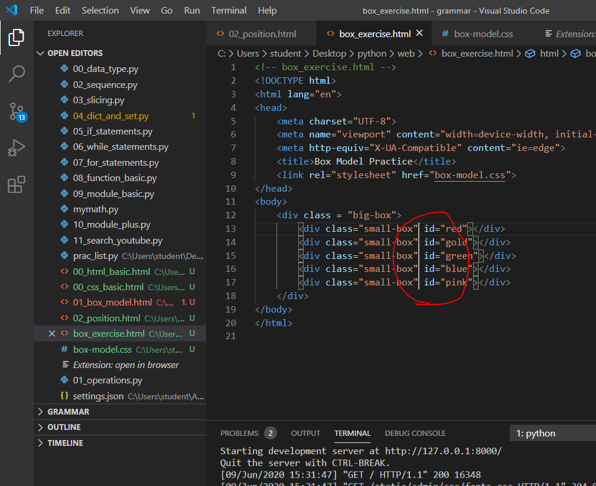

참고 링크

https://getbootstrap.com/docs/4.5/layout/grid/#row-columns

```html
<!DOCTYPE html>
<html lang="en">
<head>
  <meta charset="UTF-8">
  <meta name="viewport" content="width=device-width, initial-scale=1.0">
  <link rel="stylesheet" href="https://stackpath.bootstrapcdn.com/bootstrap/4.5.0/css/bootstrap.min.css" integrity="sha384-9aIt2nRpC12Uk9gS9baDl411NQApFmC26EwAOH8WgZl5MYYxFfc+NcPb1dKGj7Sk" crossorigin="anonymous">
  <title>Document</title>
  <style>

  </style>
</head>
<body>
  <div class="container">
    <div class="row">
      <div class="col bg-danger border">그리드 시스템</div>
      <div class="col bg-danger border">그리드 시스템</div>
      <div class="col bg-danger border">그리드 시스템</div>
    </div>
    <div class="row">
      <div class="col bg-danger border">그리드 시스템</div>
      <div class="col bg-danger border">그리드 시스템</div>
    </div>
    <div class="row">
      <div class="col-3 bg-primary border">그리드 시스템</div>
      <div class="col-6 bg-success border">그리드 시스템</div>
      <div class="col-3 bg-warning border">그리드 시스템</div>
    </div>
    <hr>
    <div class="row">
      <div class="col-3 bg-primary border">그리드 시스템</div>
      <div class="col-3 offset-3 bg-primary border">그리드 시스템</div>
      <div class="col-3 bg-primary border">그리드 시스템</div>
    </div>
    <hr>
    <div class="row justify-content-start">
      <div class="col-3 bg-danger border">그리드 시스템</div>
      <div class="col-3 bg-danger border">그리드 시스템</div>
      <div class="col-3 bg-danger border">그리드 시스템</div>
    </div>
    <!-- 중앙에 박스를 할당하고 좌 우로 빈 공간의 크기를 할당 -->
    <div class="row justify-content-center">
      <div class="col-3 bg-danger border">그리드 시스템</div>
      <div class="col-3 bg-danger border">그리드 시스템</div>
      <div class="col-3 bg-danger border">그리드 시스템</div>
    </div>
    <!-- 먼저 좌 우 끝으로 붙여놓고 그 다음 빈 공간의 크기를 할당 -->
    <div class="row justify-content-between">
      <div class="col-3 bg-danger">그리드 시스템</div>
      <div class="col-3 bg-danger">그리드 시스템</div>
      <div class="col-3 bg-danger">그리드 시스템</div>
    </div>
    <!-- 빈 공간의 크기를 빈 공간의 개수만큼 할당 -->
    <div class="row justify-content-around">
      <div class="col-3 bg-danger">그리드 시스템</div>
      <div class="col-3 bg-danger">그리드 시스템</div>
      <div class="col-3 bg-danger">그리드 시스템</div>
    </div>
    <hr>
    <div class="row justify-content-end">
      <div class="col-3 bg-danger">그리드 시스템</div>
      <div class="col-3 bg-danger">그리드 시스템</div>
      <div class="col-3 bg-danger">그리드 시스템</div>
    </div>
    <hr>
    <div class="row" style="height: 100px;">
      <div class="col align-self-start bg-secondary">그리드 시스템</div>
      <div class="col align-self-center bg-secondary">그리드 시스템</div>
      <div class="col align-self-end bg-secondary">그리드 시스템</div>
    </div>
    <hr>
    <div class="row">
      <div class="col col-sm-12 col-md-6 col-lg-3 bg-dark text-light border">그리드 시스템</div>
      <div class="col col-sm-12 col-md-6 col-lg-3 bg-dark text-light border">그리드 시스템</div>
      <div class="col col-sm-12 col-md-6 col-lg-3 bg-dark text-light border">그리드 시스템</div>
    </div>
  </div>
  <script src="https://code.jquery.com/jquery-3.5.1.slim.min.js" integrity="sha384-DfXdz2htPH0lsSSs5nCTpuj/zy4C+OGpamoFVy38MVBnE+IbbVYUew+OrCXaRkfj" crossorigin="anonymous"></script>
  <script src="https://cdn.jsdelivr.net/npm/popper.js@1.16.0/dist/umd/popper.min.js" integrity="sha384-Q6E9RHvbIyZFJoft+2mJbHaEWldlvI9IOYy5n3zV9zzTtmI3UksdQRVvoxMfooAo" crossorigin="anonymous"></script>
  <script src="https://stackpath.bootstrapcdn.com/bootstrap/4.5.0/js/bootstrap.min.js" integrity="sha384-OgVRvuATP1z7JjHLkuOU7Xw704+h835Lr+6QL9UvYjZE3Ipu6Tp75j7Bh/kR0JKI" crossorigin="anonymous"></script>
</body>
</html>
```


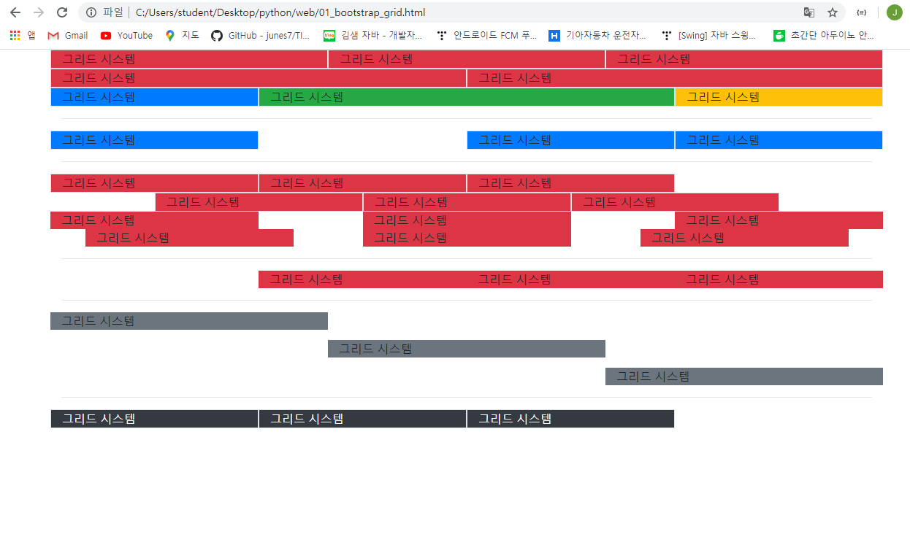

구글 뉴스, 네이버 뉴스, CSS is awesome


### Django 설치하는 방법

장고 프레임워크 설치할 때는 아래와 같이 pip install django==2.1.15 설치할 것

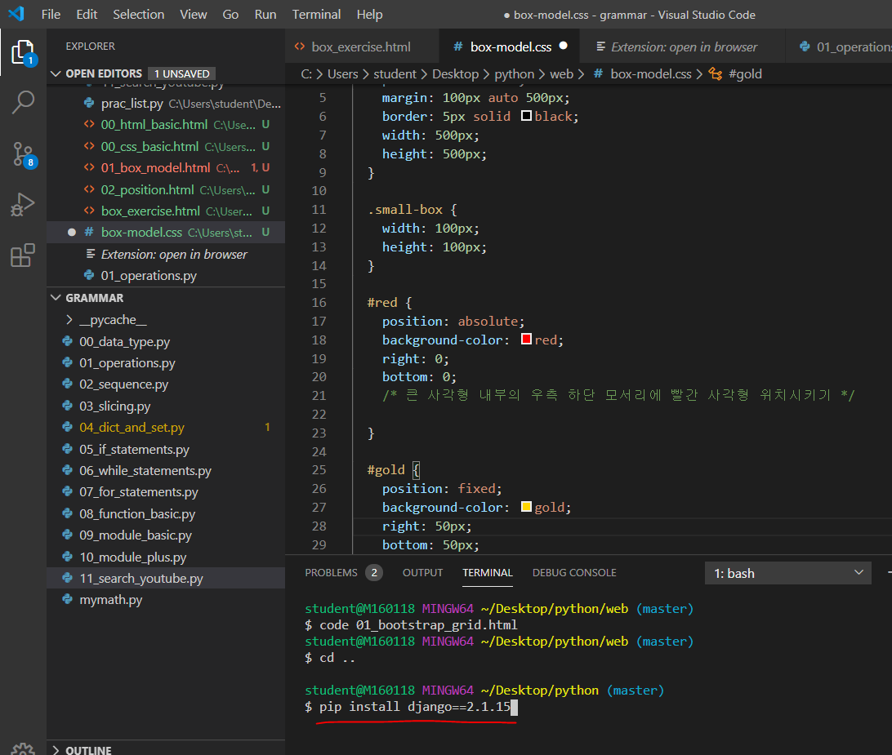

설치한 후 잘 설치 되었는지 아래와 같이 명령어를 입력해서 확인해준다.

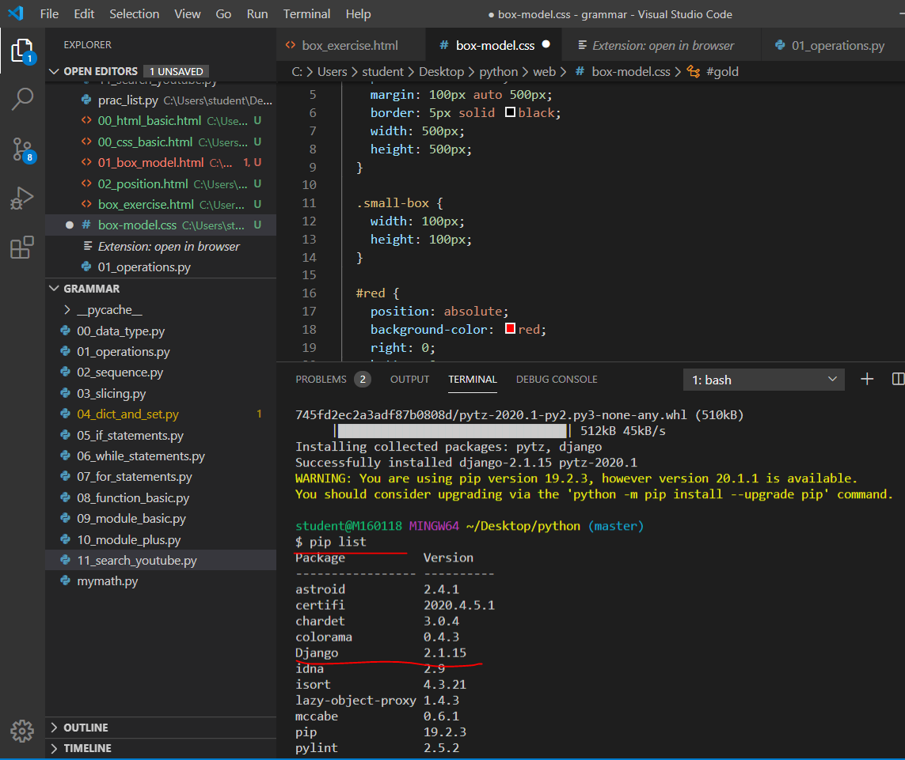

장고 프로젝트 시작하는 방법

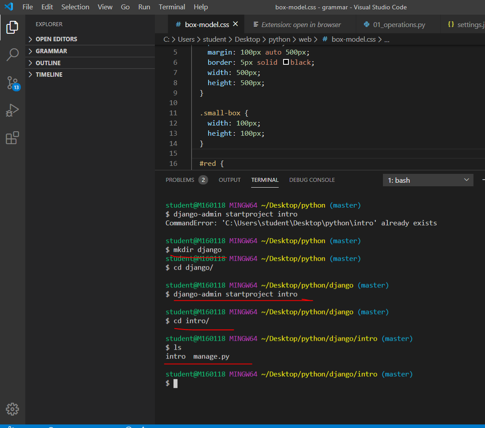

.gitignore 설정 하는 방법

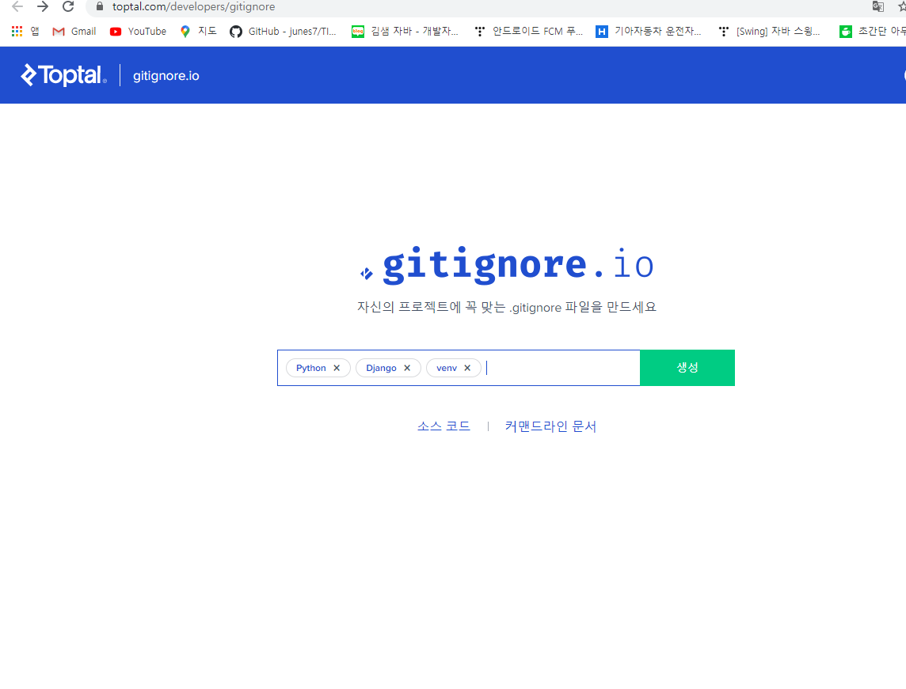

여기서 위와 같이 입력하고 생성버튼을 누르면


그러면 위와 같이 파일이 생성된다.


그랬을 때 .gitignore 파일을 생성해 넣어주면 된다.


