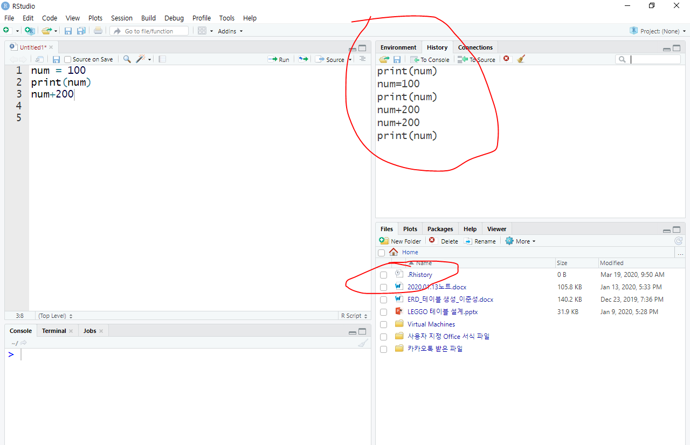
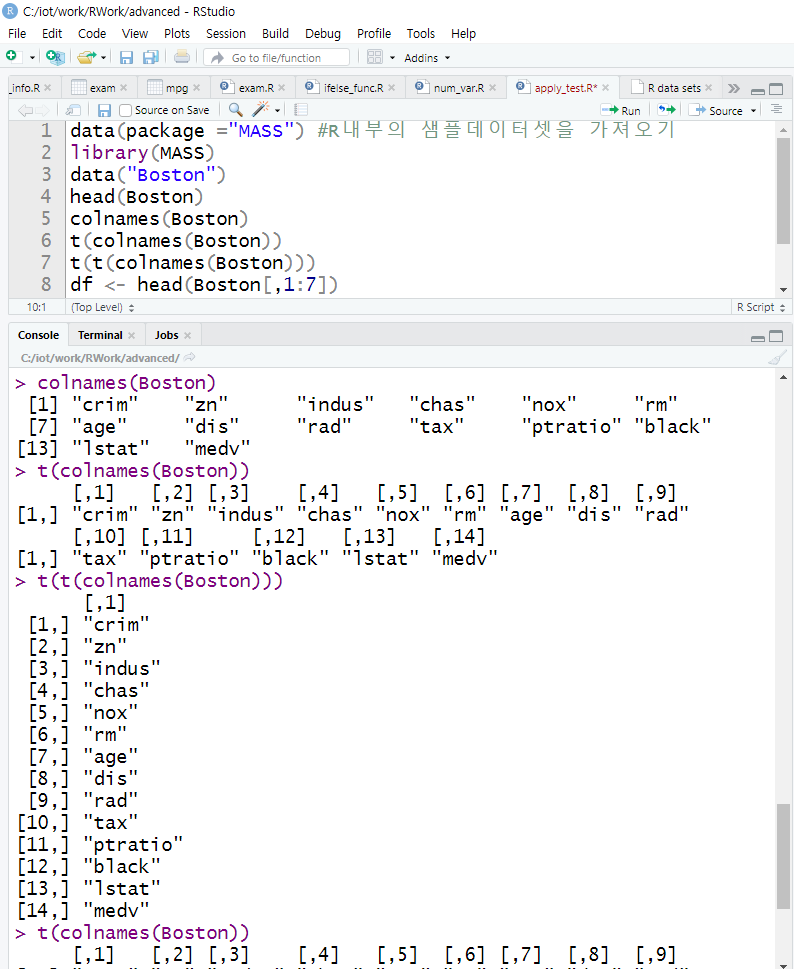

위의 빨간색 버전 다운로드 할 것

그리고 Windows버전을 선택한 후 base에서 install R for the first time 선택

그리고 아래의 R3.6.3 for windows 버전 선택한 후 

빨갛게 체크한거 다운로드한다.

RStudio 다운로드 받는 방법

위에서 desktop 버전을 선택한다.

여기 위에서 빨간거 선택

이거나

이것으로 다운로드 받을 것!!

R studio 가 python의 anaconda 역할이다. Python을 잘 사용하기 위해 존재하는 툴이 anaconda이다.

컴퓨터 이름, 사용자 이름, 설치경로에 한글 있으면 안 된다.

특수문자, 공백도 안 된다.

만약 3.6.3버전을 설치한 후 사용하다가 라이브러리 충돌이 나면은 previous releases를 들어가서 이전 버전으로 downgrade해준다.

#### R을 설치하는 방법

위와같이 빨간줄 된 것을 더블클릭해준다.

설치할 때 경로를 위와 같이 잡아준다.

위에서 32bit files 체크해제 해준다.

기본값으로 설치해준다.

바탕화면에 아아콘 생성 체크하고 설치 완료해준다.

R은 위처럼 프로그램을 구현할 수 있는 최소한의 조건만 제공해준다.

그래서 자바를 잘 쓸 수 있게 구현해 놓은 툴이 이클립스인것처럼, R을 잘 사용할 수 있게 구현해 놓은 툴이 R 스튜디오이다.

파이썬은 잘 쓸 수 있게 만들어 놓은 툴이 anaconda이다.

#### R studio 설치 방법

설치할 때 위와 같이 경로를 설정해주고 설치해준다.

#### 화면 글자 키우는 방법

pr ctrl space를 누르면 자동완성 기능이 작동된다.

ctrl +l을 누르면 console 창 화면이 지워진다.

여기 빨간 부분을 더블클릭해서 shortcut을 바꿀 수 있다.

여기 위 history는 작업한 명령을 볼 수 있다.

그리고 r.history에 작업하였던 명령이 저장된다. 이것의 저장위치는 

여기이다.

ctrl 1 스크립트 ctrl 2 콘솔

파일 → 뉴 프로젝트 → 뉴 디렉토리 → 뉴 프로젝트 → 

경로 위와같이 추가하고 create project를 클릭해 프로젝트를 생성해준다.

그리고 생성된 프로젝트에서 스크립트를 아래와 같이 저장해준다.

 

soft wrap은 줄바꿈을 해주는 설정이다.

tools → project options은 이클립스의 buildpath같은 설정이다.

이렇게 설정해준다.

전체 블록 설정하고 shift + 큰 따옴표 해주면 문자열에 큰 따옴표가 씌어진다.

전체 실행방법 ctrl+A로 전체 블록 설정  → ctrl + enter를 해준다.

여기 위에서 화살표 자동 완성 위해서 alt + - 을 눌러준다.

여기서 화면 설정 변경해준다.

 

#### Vector

위와같은 상태로 ctrl enter를 눌렀을 때 esc 누르고 빠져나온다.

아니면 중괄호를 닫아주고  ctrl enter 를 해준다. 

데이터 구조

데이터프레임: 다양한 변수 타입으로 구성할 수 있다.

매트릭스: 데이터 프레임과 마찬가지로 한 가지 변수 타입으로만구성할 수 있다.

R 프로그래밍 SQL 사용

install.packages("sqldf")

require(sqldf)

여기서 byrow 옵션을 주면 출력되는 방향이 열에서 행으로 바뀐다.

csv_exam.csv를 읽어서 데이터를 수정한 후
csv_exam_result.csv로 저장하기
-science가 80이상인 데이터를 추출
-추출된 데이터에 mytotal과 myavg컬럼을 추가
-mytotal: 모든 과목의 총점
-myavg: 모든 과목의 평균

존재하는 디렉토리의 경로를 위와 같이 잡아준다.

위 사이트에서 패키지 선택

그리고 여기서 이 하이퍼링크를 선택

#### Encoding하는 방법

위와 같이 file -> Reopen with Encoding을 선택해서 위의 choose Encoding을 열어서 위와 같이 설정해준다.

위와 같은 에러는 한레코드에 5개의 요소를 만들어야 되는데 왜 2개만 만들었냐는 에러이다.

head(dftable) 여기서 head는 위에서부터 6줄을 기본으로 읽는다.

tail도 아래에서부터 위로 6줄을 읽는다.

이렇게 나와있으면 이 결과물은 list이다.

splitstackshape

그 중에 원하는 것만 추출하게 하기 위해서 csplit이란 작업을 해준 것이다.

### 데이터를 파악할 때 사용하는 함수들

데이터를 파악할 때는 기본적으로 아래의 여섯 가지 함수를 사용한다.

| 함수      | 기능                                                         |
| --------- | ------------------------------------------------------------ |
| head()    | 데이터 앞부분 출력(맨 앞부터 아래로 6번째 행 까지)           |
| tail()    | 데이터 뒷부분 출력(맨 뒤부터 위로 6번째 행 까지)             |
| View()    | 뷰어 창에서 데이터 확인(맨 앞의 V는 대문자로 입력)           |
| dim()     | 데이터 차원 출력(데이터가 몇 행, 몇 열로 구성되어 있는지 확인) |
| str()     | 데이터 속성 출력                                             |
| summary() | 요약 통계량 출력(산출)                                       |

#### 요약 통계량 산출된 용어 의미

| 출력값 | 통계량                  | 설명                                 |
| ------ | ----------------------- | ------------------------------------ |
| Min    | 최소값(Minimum)         | 가장 작은 값                         |
| 1st Qu | 1사분위수(1st Quantile) | 하위 25%(4분의 1) 지점에 위치하는 값 |
| Median | 중앙값(Median)          | 중앙에 위치하는 값                   |
| Mean   | 평균(Mean)              | 모든 값을 더해 값의 개수로 나눈 값   |
| 3rd Qu | 3사분위수(3rd Quantile) | 하위 75%(4분의 3) 지점에 위치하는 값 |
| Max    | 최대값(Maximum)         | 가장 큰 값                           |

첫번째꺼와 3번째꺼가 많이 사용되기 때문에 위와 같이 정의되어 있다.

위의 dim은 234행 11열을 의미한다.

#### mpg 데이터의 변수들에 대한 변수명과 속성 내용

| 변수명       | 내용                   | 변수명 | 내용                      |
| ------------ | ---------------------- | ------ | ------------------------- |
| manufacturer | 제조 회사              | model  | 자동차 모델명             |
| displ        | 배기량(displacement)   | year   | 생산연도                  |
| cyl          | 실린더 개수(cylinder)  | trans  | 변속기 종류(transmission) |
| drv          | 구동 방식(drive wheel) | cty    | 도시 연비(city)           |
| hwy          | 고속도로 연비          | fl     | 연료 종류(fuel)           |
| class        | 자동차 종류            |        |                           |

[데이터 분석]

1. 데이터 가져오기

-외부파일

-크롤링

-DB(오라클,mongodb,hadoop,.........)

==> R에서 사용할 수 있는 여러 형태의 데이터로 변환. 변환된 데이터를 액세스

2. 데이터의 정보를 확인

컬럼갯수, row갯수, 타입, 유형, 실제 저장된 데이터....

apply_test 

-apply

filter

-데이터 정체

-이상데이터 잘라내기

crawl

-웹페이지에서 데이터를 추출(csv저장)

* R내부의 샘플데이터셋을 가져오기

ctrl + shift + m을 누르면 %>%가 나온다.

library는 매 스크립트마다 올려주어야 한다.

div_content>div.list_item.notice>div.list_hit

//*[@id="div_content"]/div[3]/div[4]

