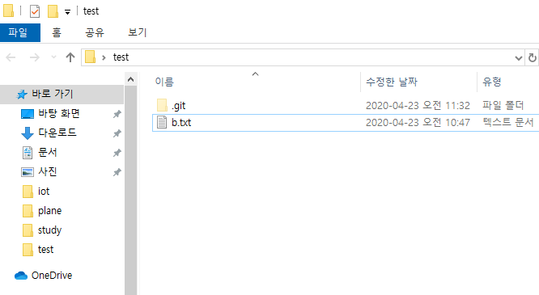

# 깃허브 특강 2

## 깃허브 정리된 링크

### 개발자 기술 면접

https://github.com/JaeYeopHan/Interview_Question_for_Beginner

### 주니어 개발자 채용 정보

https://github.com/jojoldu/junior-recruit-scheduler

### 원격 근무 회사

https://github.com/milooy/remote-or-flexible-work-company-in-korea

```bash
$git status
//위 명령어가 가장 중요하다.

```


 위 환경이 CLI 환경이다.

GUI vs CLI

GUI(Graphic User Interface)

CLI(Command Line Interface)

```bash
$ls
//모든 파일 리스트를 출력
$ls -al
//숨겨진 파일을 포함해 모든 파일을 출력해준다. 
```

git을 설정한 하위 폴더에서 git init를 쓰면 git이 묶여서 아무 작업도 할 수 없다. 

```bash
student@M1501 MINGW64 ~/Desktop/test
$ git init
Initialized empty Git repository in C:/Users/student/Desktop/test/.git/

student@M1501 MINGW64 ~/Desktop/test (master)
$ git status
On branch master

No commits yet

nothing to commit (create/copy files and use "git add" to track)

student@M1501 MINGW64 ~/Desktop/test (master)
$ touch a.txt

```


# Git status를 통해 정리하기

## 기초 명령어

```bash
#list (파일 목록)
$ ls
#change directory(디렉토리 변경)
$ cd
#빈 파일 생성
$ touch <파일명>
```


## 상황

### 1.add

```bash
$ touch a.txt
$ git status
On branch master

No commits yet
# 트래킹이 x → 새로 생성된 파일이다.
Untracked files:
# 커밋을 하기 위한 곳에 포함시키려면
# staging area로 이동시키려면, git add
  (use "git add <file>..." to include in what will be committed)
        a.txt
# WD(working directory) o, staging area X
nothing added to commit but untracked files present (use "git add" to track)
```


```bash
$ git add a.txt
$ git status
On branch master

No commits yet
# 커밋될 변경사항들(staging area O)
Changes to be committed:
	# unstage르 위해서 활용할 명령어(add 취소)
  (use "git rm --cached <file>..." to unstage)
        new file:   a.txt
```

### 2. commit

```bash
#메시지와 함께 커밋하기
$ git commit -m "Create a.txt"
#지금까지 커밋된 파일 보기
$ git log
commit 38db6158212e55285dff575ebb7879912f7db187 (HEAD -> master)
Author: junes7 <2junes@naver.com>
Date:   Thu Apr 23 10:36:25 2020 +0900

    Create a.txt

$ git log --oneline
38db615 (HEAD -> master) Create a.txt
```

### 3. 추가 파일 변경 상태

```bash

$ touch b.txt
$ git status
On branch master
Changes not staged for commit:
  (use "git add <file>..." to update what will be committed)
  (use "git restore <file>..." to discard changes in working directory)
        modified:   a.txt

Untracked files:
  (use "git add <file>..." to include in what will be committed)
        b.txt

no changes added to commit (use "git add" and/or "git commit -a")
$ git add a.txt
$ git status
On branch master
Changes to be committed:
  (use "git restore --staged <file>..." to unstage)
        modified:   a.txt

Untracked files:
  (use "git add <file>..." to include in what will be committed)
        b.txt
$ git add .
$ git status
On branch master
Changes to be committed:
  (use "git restore --staged <file>..." to unstage)
        modified:   a.txt
        new file:   b.txt
$ git commit -m 'a.txt 수정, b.txt 생성'
[master d3e9aa3] a.txt 수정, b.txt 생성
 2 files changed, 1 insertion(+)
 create mode 100644 b.txt
$ git status
$ git add a.txt
$ commit -m 'a.txt 추'
[master b8f27c4] a.txt 추
 1 file changed, 1 insertion(+), 1 deletion(-)
```

### 4. 커밋 메시지 변경

> 주의!! 커밋 메시지 변경시 해시값 자체가 변경되어,
>
> 이미 원격저장소에 push한 이력에 대해서는 메시지
>
> 변경을 하면 안된다.

```bash
$ git commit --amend
```

* `vim` 텍스트 편집기가 실행된다.
  * `i`: 편집 모드
  * `esc` 편집 모드를 종료하고, 명령 모드에서 저장
    * `:wq`
      * write + quit


git commit --amend를 사용하면 위와 같은 vim 화면이 나온다.

```bash
$ git commit --amend
[master f4ff6ef] a.txt 추가
 Date: Thu Apr 23 10:48:03 2020 +0900
 1 file changed, 1 insertion(+), 1 deletion(-)
```

```bash
$ git log --oneline
f4ff6ef (HEAD -> master) a.txt 추가
d3e9aa3 a.txt 수정, b.txt 생성
38db615 Create a.txt
$ git commit --amend
[master 313209a] a.txt 추가
 Date: Thu Apr 23 10:48:03 2020 +0900
 1 file changed, 1 insertion(+), 1 deletion(-)
$ git log --oneline
313209a (HEAD -> master) a.txt 추가
d3e9aa3 a.txt 수정, b.txt 생성
38db615 Create a.txt
```

#### 4-1. 특정 파일을 빼놓고 커밋 했을 때

```bash
$ git add <omit_file>
$ git commit - amend
```

* 빠뜨린 파일을 add한 이후에 `commit --amend`를 하면, 해당 파일까지 포함하여 재커밋이 이뤄진다.

* a.k.a 작업 하던 내용 버리기

```bash
$ git status
On branch master
Changes not staged for commit:
  (use "git add <file>..." to update what will be committed)
  (use "git restore <file>..." to discard changes in working directory)
        modified:   a.txt

no changes added to commit (use "git add" and/or "git commit -a")
$ git restore a.txt
$ git status
On branch master
nothing to commit, working tree clean
```

### 5. 특정 파일/폴더 삭제 커밋

> 해당 명령어는 실제 파일이 삭제되는 것은 아니지만, git에서 삭제되었다라는 이력을 남기는 것이다.


```bash
$ git status
On branch master
Changes to be committed:
  (use "git restore --staged <file>..." to unstage)
        deleted:    b.txt

Untracked files:
  (use "git add <file>..." to include in what will be committed)
# 주의!! 해당 파일이 물리적으로 삭제 되는 것은 아니다.
```



위와 같이 물리적으로 a.txt를 삭제했을때는 아래와 같은 상황이 나온다.

```bash
$ git status
On branch master
Changes to be committed:
  (use "git restore --staged <file>..." to unstage)
        deleted:    b.txt

Changes not staged for commit:
  (use "git add/rm <file>..." to update what will be committed)
  (use "git restore <file>..." to discard changes in working directory)
        deleted:    a.txt

Untracked files:
  (use "git add <file>..." to include in what will be committed)
        b.txt

```


* 일반적으로는 `.gitignore`와 함께 활용한다.

1. `.gitignore`에 해당 파일 등록

2. `git rm --cached b.txt`를 통해 삭제 커밋

* 이렇게 작업을 하면, 실제 파일은 삭제되지 않지만 이후로 git으로 전혀 관리되지 않는다.

   	


### .gitignore

#### .gitignore 쓰는 방법

* git으로 관리하고 싶지 않는 파일을 등록하여 활용할 수 있다.

* 일반적으로 프로젝트 환경(IDE, OS등)에 관련된 정보나 추가적으로 공개되면 안 되는 데이터 파일 등을 설정한다.
* 일반 프로젝트 환경에 대한 정보는 우선[gitignore.io](https://www.gitignore.io/)에서 프로젝트 시작할 때마다 정의하는 습관을 가지자.

```bash
# 특정 파일
secret.csv
# 특정 폴더
idea/
# 특정 확장자
*.csv
# 특정 폴더에서 특정 파일 빼고
!idea/a.txt
```

vim adventure

h left

I right

j below

k top

### 6. 원격 저장소 활용 명령어

#### 1. 원격 저장소 목록 조회

```bash
$ git remote -v
```

#### 2. 원격 저장소 설정 삭제

```bash
$ git remote rm {원격저장소이름}
```

#### 3. 원격 저장소 설정

```bash
$ git remote add orign url
#깃아 원격저장소에 추가해줘 오리진이라고, url을
```


```bash
$ sudo rm -rf /

# 내컴퓨터의 모든 것을 삭제하는 것


$ git push origin master
```


Notion도 정리 앱이다.

Naver D2도 개발툴이다.

emojipedia.org

https://www.gitignore.io/

```bash
$ git config --global -l
```


Github student developer


*정적 사이트 생성기(generator)

.md => HTML/CSS, js

jekyll(ruby)

-오래되고, 자료 많고

gatsby(js,react + graphql)

-최신, 근데 유명해서 자료가 많음


https://code.visualstudio.com/docs/?dv=win

여기 들어가서 visual studio code download


이렇게 설정할 것


여기 안에서 오른쪽 클릭하고 visual studio 코드 열기 할 것


여기서 도메인 입력하면 도메인으로 연결할 수 있다.

resume.min.css vs resume.css 차이

resume.min.css 는 resume.css에서 괄호와 탭을 날리고 

한 줄로 써서 용량을 kb로 줄인 버전이다.

아이콘 찾는 곳

https://fontawesome.com/icons?d=gallery

좋은 git 커밋 메시지를 작성하기 위한 7가지 약속

https://meetup.toast.com/posts/106

마크다운 이용해 정리하기 좋은 텍스트 에디터 

https://www.notion.so/desktop

https://fontawesome.com/icons/java?style=brands


깃 명령어 정리

https://nachwon.github.io/git-command/

https://blog.outsider.ne.kr/572


https://startbootstrap.com/themes/resume/

https://code.visualstudio.com/docs/?dv=win