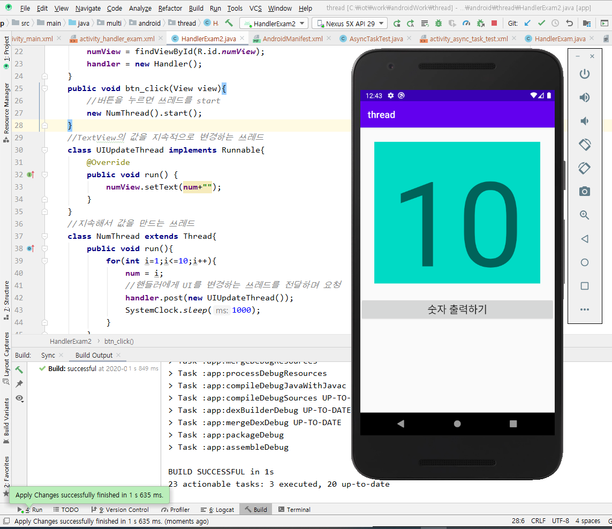
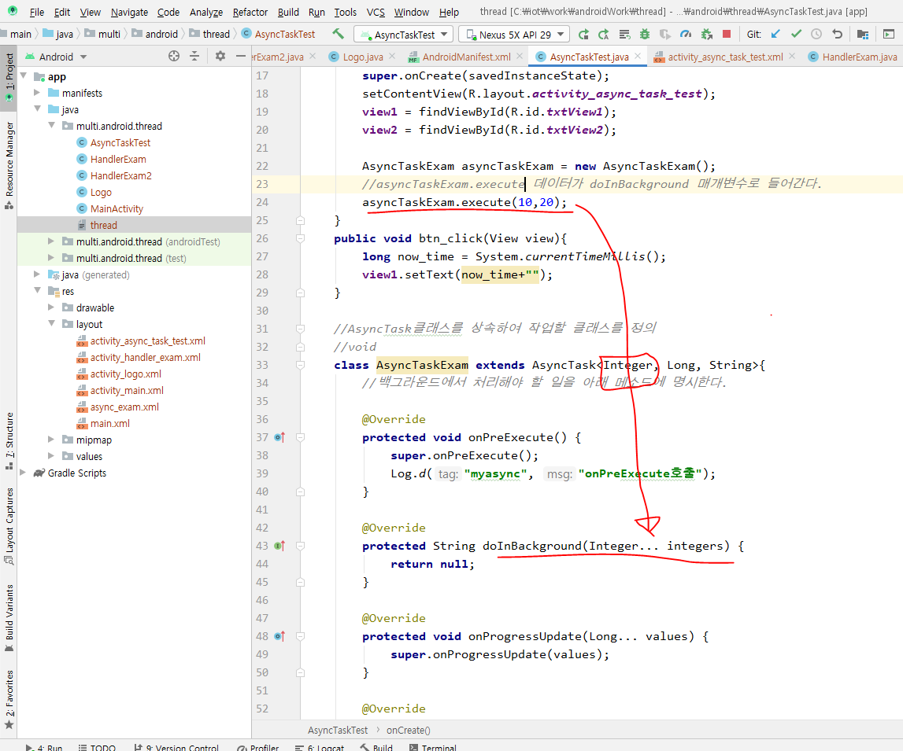
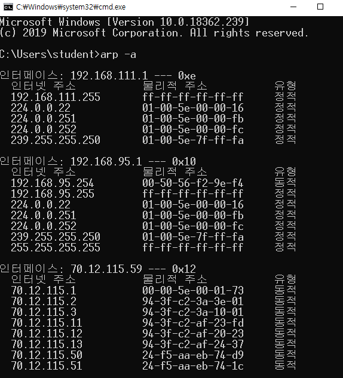

### 쓰레드의 구현과 실행

#### => 쓰레드 클래스를 상속해서 사용할 가능성이 높다.

#### 1. Thread 클래스를 상속

```java
class MyThread extends Thread {
    public void run() {/* 작업내용 */}
    //Thread클래스의 run()을 오버라이딩
}
```

#### 2. Runnable 인터페이스를 구현

```java
class MyThread implements Runnable {
    public void run() {/* 작업내용 */}
   //Runnable인터페이스의 run()을 구현
}
```

#### java.lang.Thread


```java
public class Thread {
    Runnable target;
    public Thread(Runnable target){
        this.target = target;
    }
}

public void run(){
    
}

```


#### 1. 쓰레드 프로그래밍을 구현하세요.

1부터 100까지 출력하는 DigitThread

-A부터 Z(A~Z)까지 출력하는 AlphaThread

-ThreadExam01의 main메소드에서

DigitalThread와 AlphaThread를 동시에 실행해보자


#### 2. 멀티쓰레딩의 장단점

멀티쓰레딩의 장점

CPU의 사용률을 향상시킨다.

자원을 보다 효율적으로 사용할 수 있다.

사용자에 대한 응답성이 향상된다.

작업이 분리되어 코드가 간결해진다.


static Thread currentThread() 현재 실행중인 쓰레드의 참조를 반환한다.

String getName() 쓰레드의 이름을 반환한다.


1.파이널 구상

2.두번째 프로젝트

3.통신

4.개인적으로 해야될 일

#### ThreadTest02를 RunnableTest02로 변경

#### - Runnable을 상속받도록 구현

#### - AlphaThread -> AlphaThread2

#### - DigitThread -> DigitThread2


* ##### Thread클래스를 상속받은 경우와 Runnable인터페이스를 구현한 경우에 인스턴스 생성방법이 다르다.

```java
ThreadEx1_1 t1 = new ThreadEx1_1(); 		//Thread의 자손 클래스의 인스턴스를 생성 
Runnable r = new ThreadEx1_2();				//Runnable을 구현한 클래스의 인스턴스를 생성
Thread t2 = new Thread(r);					//생성자 Thread(Runnable target)
Thread t2 = new Thread(new ThreadEx1_2());	//위의 두 줄을 한 줄로 간단히
```


#### 1. 두 계좌의 잔액을 더하는 쓰레드

#### -SharedObj객체의 계좌잔액을 더해서 sysout으로 출력하는 쓰레드

#### -5번 출력할 수 있도록

#### 2. acc1계좌에서 acc2계좌에 100만원 씩 이체하는 작업을 수행하는 쓰레드

-20번 이체할 수 있도록 => Account클래스 활용

-SharedObj객체를 이용해서 작업

#### 3. 동기화하지 않고 테스트

#### 4. 동기화하고 테스트


#### 메소드를 동기화

public synchronized 리턴타입 메소드명(){

}


#### 코드블럭을 동기화

synchronized(공유객체){

//동기화 시킬 코드를 정의

}


버튼 누르면 1~10까지 출력

Handler 마지막 구현했던것 이용해서 구현

한번 클릭하면 1부터 10까지 출력


WEB(Spring Framework)은 멀티 쓰레드 방식으로 돌려 주었기 때문에 서버를 신경 쓸 필요가 없었다.





보통 앱들은 로고를 띄우는 동안 데이터를 받아온다.




AsyncTask에 데이터 타입을 generic으로 Integer를 선언해준다.

doInBackground 랑 onProgressUpdate를 왔다 갔다 한다.


| 메서드 이름      | 설명                                                         |
| ---------------- | ------------------------------------------------------------ |
| doInBackground   | 새로 만든 스레드에서 백그라운드 작업을 수행합니다. execute()메서드를 호출할 때 사용된 파라미터를 배열로 전달받습니다. |
| onPreExecute     | 백그라운드 작업을 수행하기 전에 호출됩니다. 메인 스레드에서 실행되며 초기화 작업에 사용됩니다. |
| onProgressUpdate | 백그라운드 작업의 진행 상태를 표시하기 위해 호출됩니다. 작업 수행 중간 중간에 UI객체에 접근하는 경우에 사용됩니다. 이 메서드가 호출되도록 하려면 백그라운드 작업 중간에 publishProgress()메서드를 호출해야 합니다. |
| onPostExecute    | 백그라운드 작업이 끝난 후에 호출됩니다. 메인 스레드에서 실행되며 메모리 리소스를 해제하는 등의 작업에 사용됩니다. 백그라운드 작업의 결과는 Result타입의 파라미터로 전달됩니다. |
| onCancelled      | 백그라운드 작업을 취소할 수 있습니다.                        |
| getStatus        | 백그라운드 작업의 진행상황을 확인하고 싶을 때 사용합니다. 각각의 상태는 PENDING(작업이 시작되지 않았음),  RUNNING(실행 중), FINISHED(종료되었음)로 구분됩니다. |
|                  |                                                              |




### 네트워크 통신

HTTP 특징 stateless 한 번 가면 끊기기 때문에 이 특성을 극복하기 위해서 cookie같은 것을 만져준다.

TCP/IP 연결지향 프로토콜


wireshark 대표적 패킷 캡쳐 프로그램

싱글 콘솔 채팅 어렵다.

쓰레드, 네트워크, I/O도 알고 있어야 한다.

URLTest2.java

image copy

image 폴더에 저장


### Collection Class 정리 및 요약

| 컬렉션        | 특 징                                                        |
| ------------- | ------------------------------------------------------------ |
| ArrayList     | 배열기반, 데이터의 추가와 삭제에 불리. 순차적인 추가삭제는 제일 빠르다. 임의의 요소에 대한 접근성(Accessibility)이 뛰어나다. |
| LinkedList    | 연결기반. 데이터의 추가와 삭제에 유리하다. 임의의 요소에 대한 접근성이 좋지 않다. |
| HashMap       | 배열과 연결이 결합된 상태. 추가, 삭제, 검색, 접근성이 모두 뛰어나다. 검색에는 최고성능을 보인다. |
| TreeMap       | 연결기반. 정렬과 검색(특히 범위검색)에 적합. 검색성능은 HashMap보다 떨어진다. |
| Stack         | Vector를 상속받아 구현                                       |
| Queue         | LinkedList가 Queue 인터페이스를 구현                         |
| Properties    | Hashtable을 상속받아 구현                                    |
| HashSet       | HashMap을 이용해서 구현                                      |
| TreeSet       | TreeMap을 이용해서 구현                                      |
| LinkedHashMap | HashMap과 HashSet에 저장순서유지기능을 추가                  |
| LinkedHashSet | HashMap과 HashSet에 저장순서유지기능을 추가                  |


