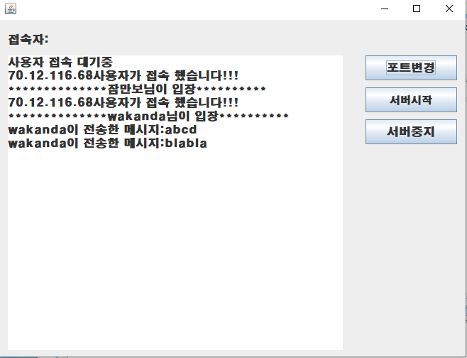

# 멀티 채팅 구현방법

#### swing

#### 	-> java fx(css,javascript)

Chatlogin 클래스를 만드는 작업

#### 이클립스 플러그인 window builder툴을 설치하고 드래그 앤 드랍으로 화면디자인

#### combobox

1. #### 서버실행

   #### ChatServerView (ChatServerListener)

   -----------------------------------

   ​			^

   #### 			|________서버가 여러 가지 상태를 확인할 수 있는 장면

2. 클라이언트 접속

   #### 1) ChatLogin(ChatLoginListener)를 먼저 실행해서 로그인(ip, port, 채팅, nickname)

   #### 2) ClientChatView 가 실행(ClientChatListener)

   -----------------------------------

   ​				^

   #### 				|_________클라인트가 채팅하는 화면

멀티 채팅 실행하는 방법

ChatServerView -> ChatLogin -> ClientChatView

이게 JFrame이다.

#### 서버에서 띄워지는 메시지

