# 안드로이드 머티리얼 디자인

### 머티리얼 디자인이란?

플랫품 및 기기 전반의 시각적 요소, 움직임 및 상호작용 디자인을 위한 포괄적인 가이드이다.

#### 머티리얼 테마 및 위젯

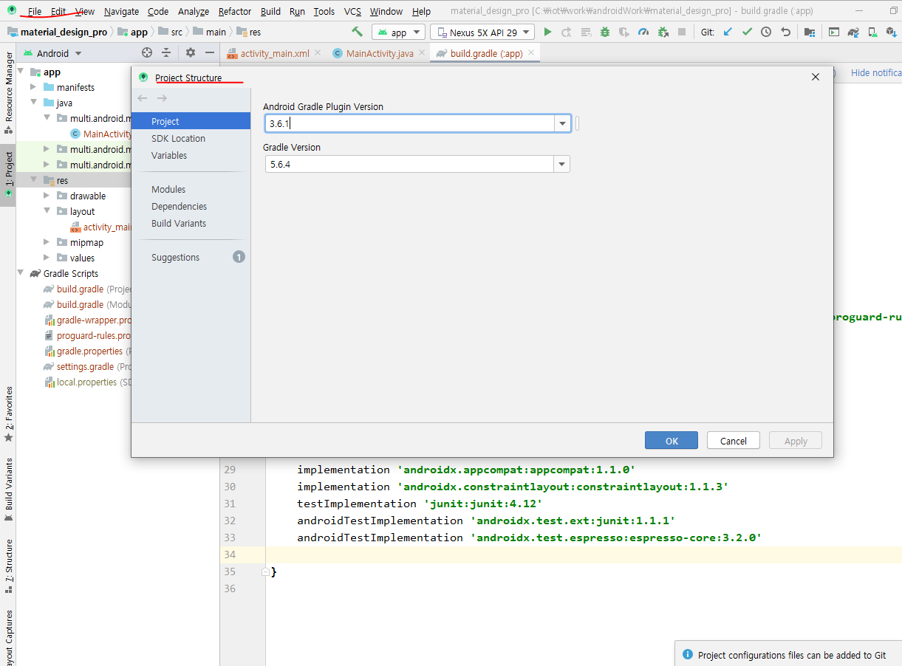

tool을 사용하려면 아래와 같이 설정해주면 된다. 

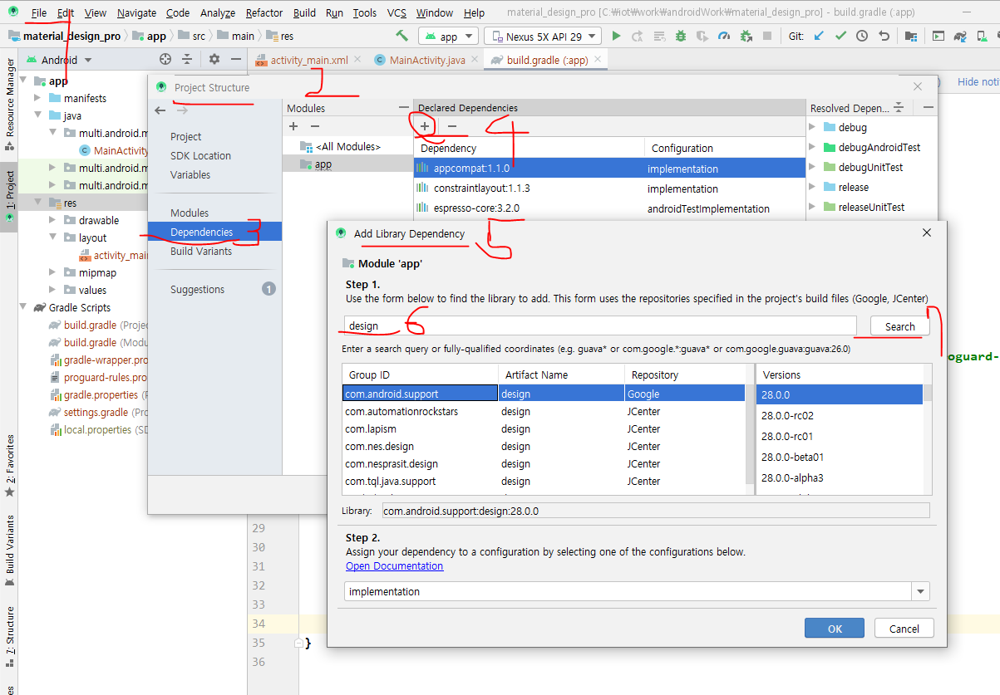

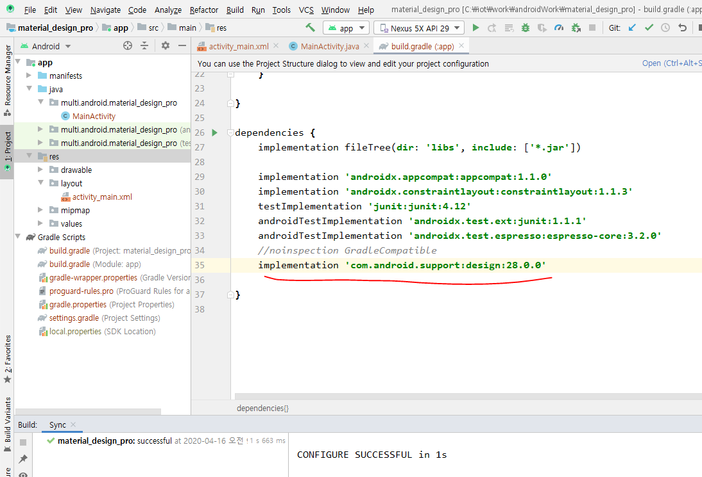

여기 위에 빨간 줄 뜨는게 있는데 그것을 누르면 Add://뭐라고 나오는데 그것을 누르면 Sync Now를 눌러준다.

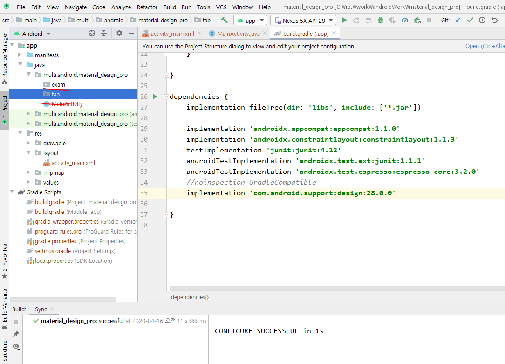

그 다음 이렇게 exam, tab 패키지를 생성해준다.

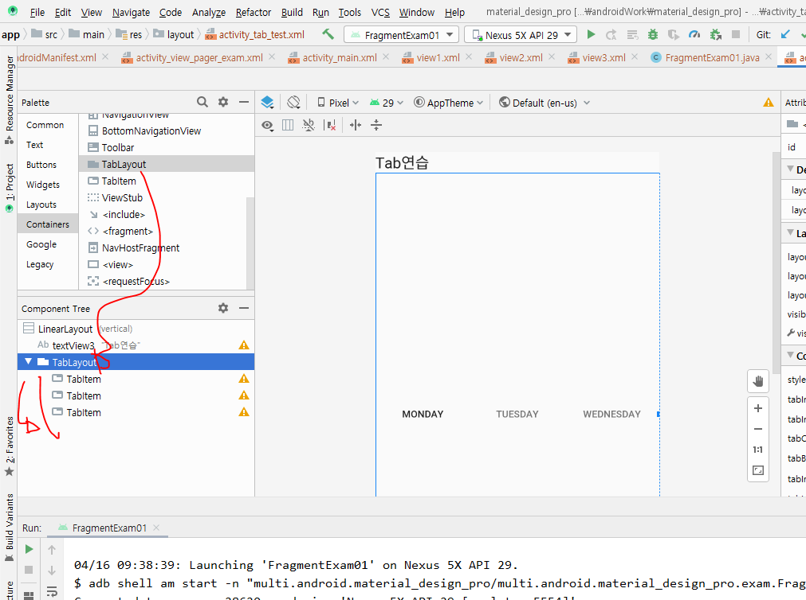

그리고 이렇게 설정해준다.

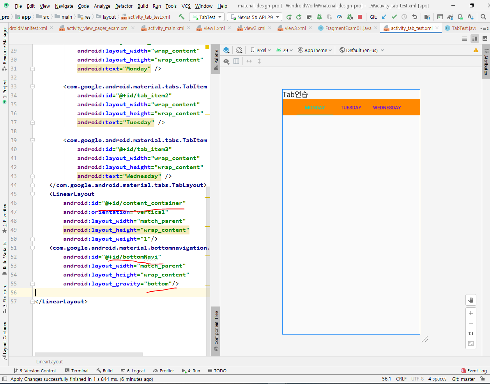

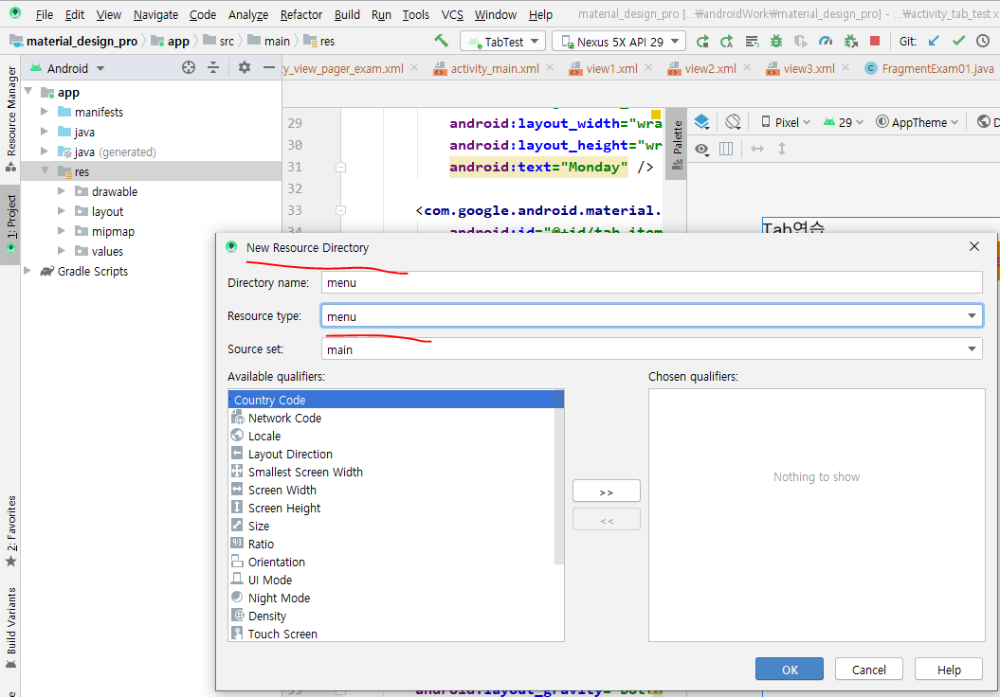

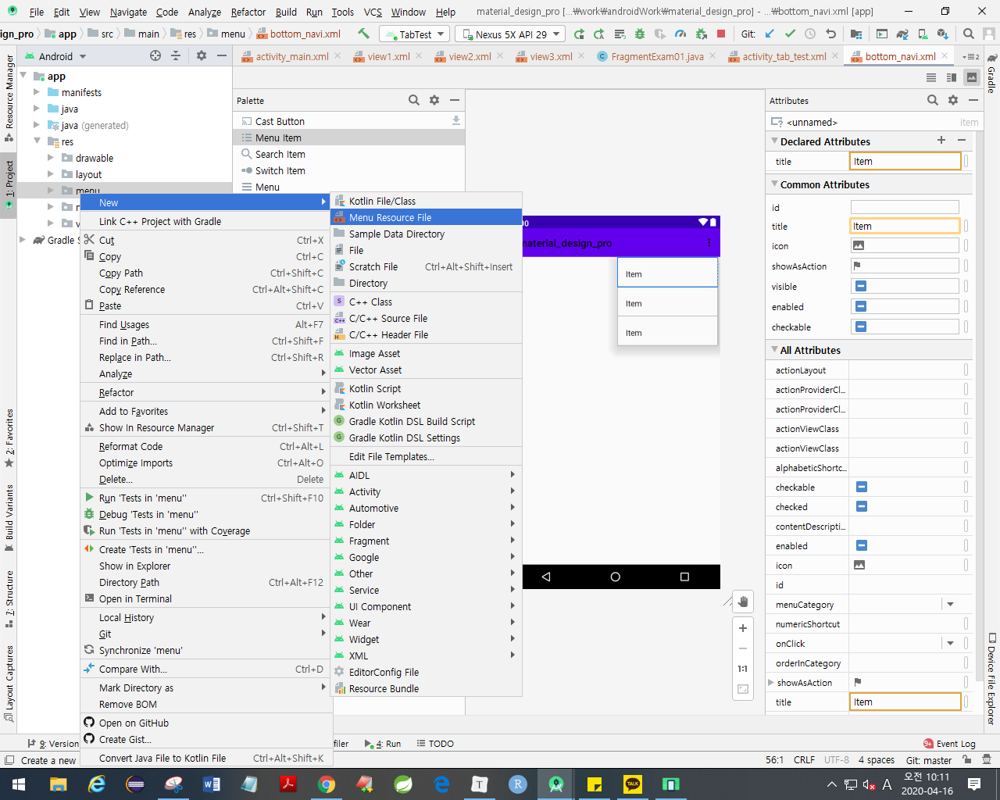

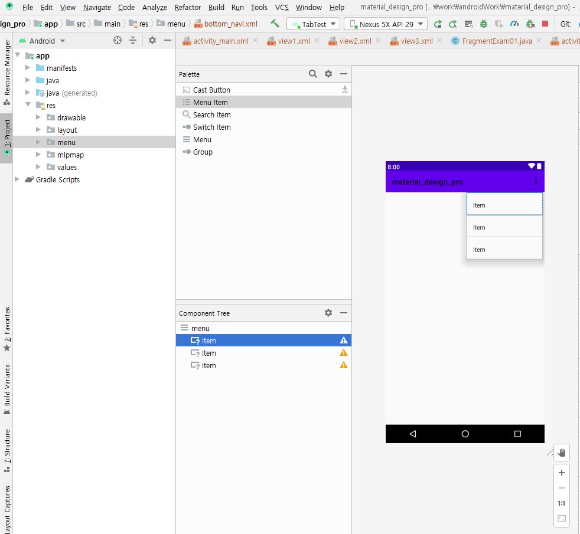

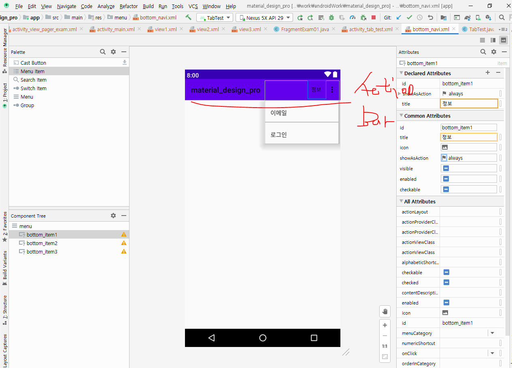

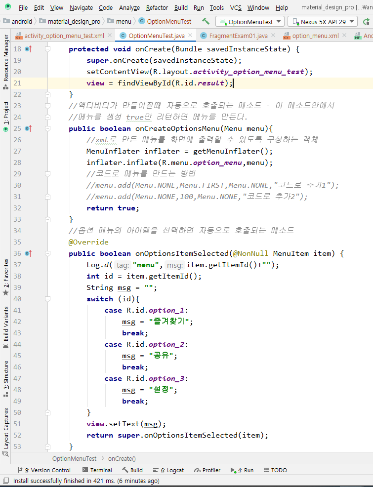

always 항상 표시

ifRoom 공간이 허용하면 표시

collapseActionView 펼쳤다 접었다 표시

withText 텍스트랑 아이콘을 같이 보여주겠다고 하는 것

### Appbar

### Toolbar

ActivityNotFoundException 에러 나오면 AndroidManifest에 파일이 올라가 있는지 확인할 것!!

FragmentExam01에 TabLayout을 추가

-버튼과 연결되어 있는 프레그먼트를 탭과 연결되도록 수정하기

-구조를 변경하지 말고 버튼 대신에 TabLayout을 추가하기

=>layout xml파일을 변경

=>버튼을 지우고 tab을 추가

-TabTest2를 참고해서 코드로 ViewPager와 TabLayout이 연결되도록 수정

#### startActivity 와 startActivityforResult 차이점

####  

### 머티리얼 디자인 마무리

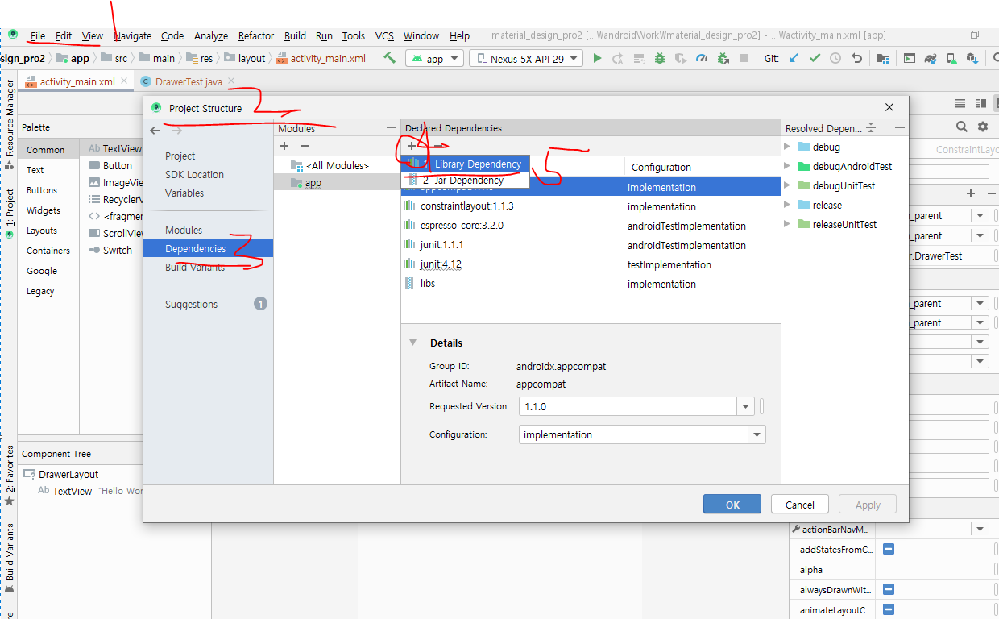

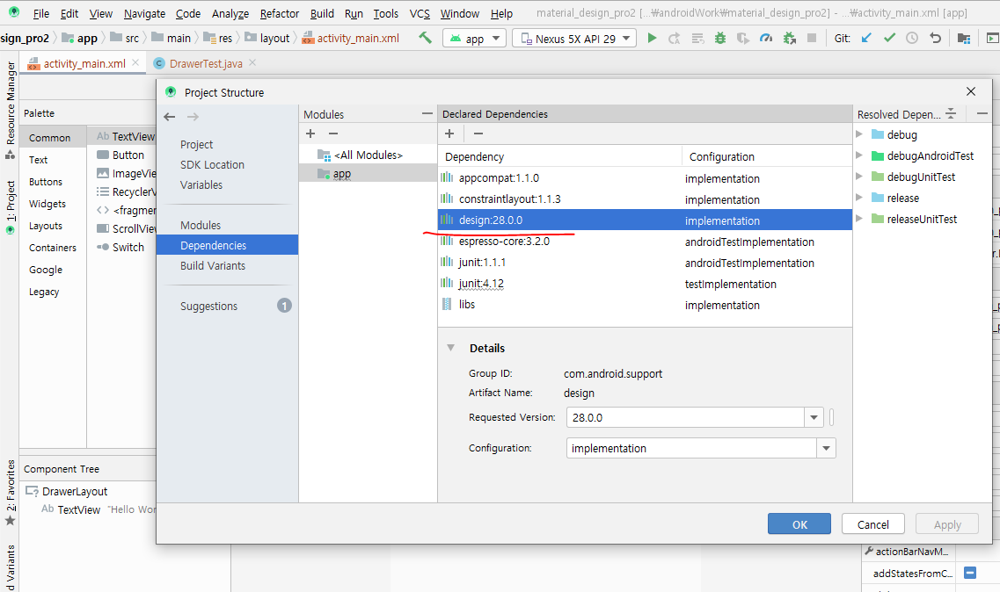

위와같이 support design 등록한다.

NavigationView는 기본적으로 숨겨져 있어야 한다.

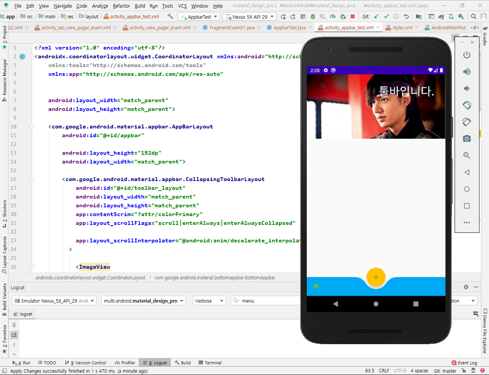

리사이클러뷰(RecyclerView): 많은 수의 데이터 집합을, 제한된 영역 내에서 유연하도록 만들어주는 위젯

사용자가 관리하는 많은 수의 데이터 집합을 개별 아이템 단위로 구성하여 화면에 출력하는 뷰그룹(ViewGroup)이며, 한 화면에 표시되기 힘든 많은 수의 데이터를 스크롤 가능한 리스트로 표시해주는 위젯이다.

#### 1. 리사이클러뷰(RecyclerView)

리사이클러뷰는 v7지원 라이브러리에서 제공되는 위젯으로, 앞서 소개한 구성 요소들을 통해, 사용자 데이터를 리스트 형태로 화면에 표시하는 컨테이너 역할을 수행한다.

#### 2. 어댑터(Adapter)

리사이클러뷰에 표시될 아이텀 뷰를 생성하는 역할은 어댑터가 담당한다. 사용자 데이터 리스트로부터 아이템 뷰를 만드는 것. 그것이 바로 어댑터가 하는 역할이다.

수직 방향으로 아이템을 배치할 수 있는 리스트뷰와 다르게, 리사이클러뷰는 다양한 형태로 아이템을 배치할 수 있다. 이를 위해, 어댑터에서 아이템 뷰를 생성하기 이전에, 어떤 형태로 배치될 아이템 뷰를 만들 것인지를 결정하는 요소가 제공되는데, 바로 이것이 레이아웃매니저(LayoutManager)이다.

#### 3. 레이아웃매니저(LayoutManager)

레이아웃매니저는 리사이클뷰가 아이템을 화면에 표시할 때, 아이템 뷰들이 리사이클러뷰 내부에서 배치되는  형태를 관리하는 요소이다.

※각 레이아웃매니저가 아이템 뷰들을 배치하는 형태

◎ 리니어(LinearLayoutManager): 수평(Horizontal) 또는 수직(Vertical) 방향, 일렬(Linear)로 아이템 뷰 배치

◎ 그리드(GridLayoutManager): 바둑판 모양의 격자(Grid)형태로 아이템 뷰 배치

◎스태거드 그리드(StaggeredGridLayoutManager): 엇갈림(Staggered) 격자(Grid) 형태로 아이템 뷰 배치

리사이클러뷰 워크플로우

1. 메인액티비티에 리사이클러뷰 추가 (content_main.xml에 RecyclerView 추가)
2. 아이템 뷰 레이아웃 추가 (/res/layout/recyclerview_item.xml)
3. 리사이클러뷰 어댑터 구현 (extends RecyclerView.Adapter)
4. 어댑터, 레이아웃매니저 지정(setAdapter(), setLayoutManager())

리사이클러뷰는 요소 리스트를 왼쪽 오른쪽으로 보여주는 역할을 하는데 이미지와 글이 필요하다.

#### 4. 리사이클러뷰 어댑터 구현

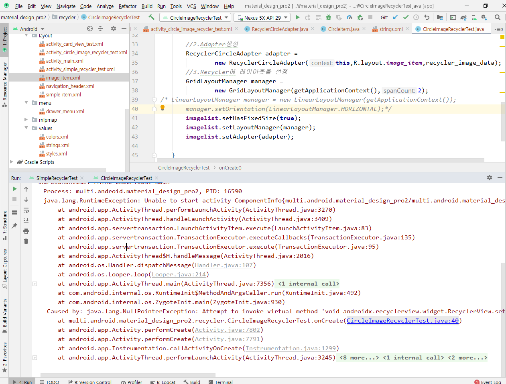

### 안드로이드 4대 구성 요소

### 맵이랑 위치기반 서비스

BasicLocationTest2

startLocationService
getLocation 정보 뿌려줄 때
onLocationChanged 위치 정보 바뀌었을 대 

thread는 전화를 받는것이 주 목적이다.

아무런 처리를 하지 않았지만

하나의 프로세스 안에서 여러 개의 실행목록을 갖고 있을 때 사용하는 것이 Thread이다.

실행중인 프로그램은 프로세스이다.

하나의 프로그램을 띄워놓고 동시에 여러개의 작업을 실행할 수 있도록 하는 것이 멀티 쓰레드 프로그램이다.

프로세스 안의 프로세스이다.

헤더 네비에 서클 적용해서 구현할 것

