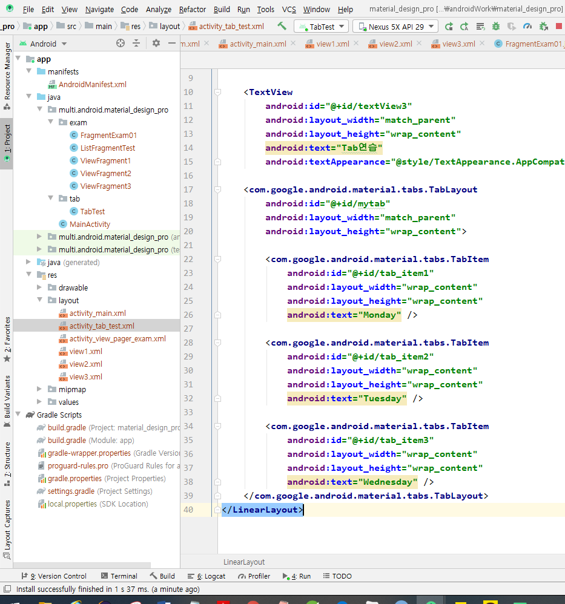

# 안드로이드 머티리얼 디자인

### 머티리얼 디자인이란?

플랫품 및 기기 전반의 시각적 요소, 움직임 및 상호작용 디자인을 위한 포괄적인 가이드이다.

#### 머티리얼 테마 및 위젯

tool을 사용하려면 

여기 위에 빨간 줄 뜨는게 있는데 그것을 누르면 Add://뭐라고 나오는데 그것을 누르면 Sync Now를 눌러준다.

그 다음 이렇게 exam, tab 패키지를 생성해준다.

그리고 이렇게 설정해준다.

always 항상 표시

ifRoom 공간이 허용하면 표시

collapseActionView 펼쳤다 접었다 표시

withText 텍스트랑 아이콘을 같이 보여주겠다고 하는 것

### Appbar

### Toolbar

ActivityNotFoundException 에러 나오면 AndroidManifest에 파일이 올라가 있는지 확인할 것!!

FragmentExam01에 TabLayout을 추가

-버튼과 연결되어 있는 프레그먼트를 탭과 연결되도록 수정하기

-구조를 변경하지 말고 버튼 대신에 TabLayout을 추가하기

=>layout xml파일을 변경

=>버튼을 지우고 tab을 추가

-TabTest2를 참고해서 코드로 ViewPager와 TabLayout이 연결되도록 수정

